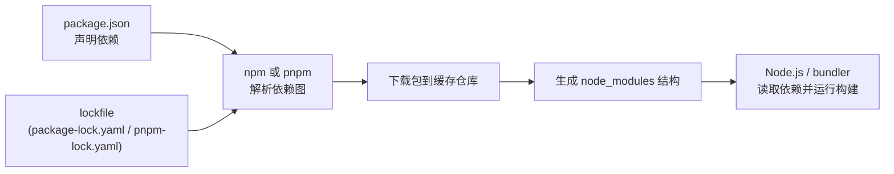

# node_modules、npm、pnpm：关系、作用与实践全解

这篇文章解决一个常见混淆：

- `node_modules` 到底是什么？
- `npm` 和 `pnpm` 是不是同一种东西？
- 为什么同样是安装依赖，磁盘占用能差这么多？

如果你把前端工程看成“建房子”：

- `package.json` 是设计图（声明需要哪些材料）。
- `npm` / `pnpm` 是采购与仓储系统（去拉取、解析、安装依赖）。
- `node_modules` 是工地上的材料堆放区（Node.js 运行时实际读取的依赖目录）。

---

## 一句话定义

- **`node_modules`**：依赖包在项目中的落地目录，是运行时和构建工具真正读取的地方。
- **`npm`**：Node.js 官方包管理器（CLI + 生态规范 + 默认 registry），负责安装、升级、发布、锁定版本等。
- **`pnpm`**：兼容 npm 生态的高效包管理器，核心目标是更省磁盘、更快安装、更严格依赖边界。

它们不是互斥关系，而是“工具与产物”的关系：

- `npm`/`pnpm` 是“怎么装”。
- `node_modules` 是“装完后给 Node 用的目录”。

---

## 先看整体关系图

重点：`lockfile` 决定“装哪一版”，包管理器决定“怎么装、装成什么结构”。

---

## 什么是 node_modules

`node_modules` 是一个目录，不是一个工具。

它的职责很单纯：

1. 给 Node.js 的模块解析算法提供可查找的包。
2. 给打包工具（Vite、Webpack、Rollup）提供依赖源码或构建产物。
3. 给 TypeScript、ESLint、测试框架提供类型和插件。

### 为什么它经常“很大”

常见原因有四个：

1. **依赖树深且广**：你只装了 100 个直接依赖，实际可能拉了上千个间接依赖。
2. **重复版本**：同名包不同版本并存，无法完全复用。
3. **工具链重**：如 `typescript`、`eslint`、UI 组件库、地图/多媒体库都很占空间。
4. **多个项目各有一份**：每个项目一个 `node_modules`，重复浪费明显。

### 常见误区

- 误区 1：`node_modules` 越小越好。  
  事实：要在“体积、安装速度、兼容性、稳定性”之间平衡。
- 误区 2：删掉 `node_modules` 就坏了。  
  事实：它是可再生目录，删后可通过 lockfile 重建。

---

## npm 的作用与工作方式

`npm` 包含三层意义：

1. **CLI 工具**：`npm install`、`npm run`、`npm publish`。
2. **依赖规范实现者**：语义化版本、peerDependencies、scripts 生命周期。
3. **生态入口**：默认连接 npm registry（也支持私有源）。

### npm 安装时干了什么

以 `npm install` 为例，通常会经过：

1. 读取 `package.json`。
2. 结合 `package-lock.json` 计算依赖树。
3. 从 registry 拉包，写入本地缓存（默认在 `~/.npm`）。
4. 把包“铺”到项目 `node_modules`（含一定 hoisting）。
5. 执行必要生命周期脚本（如 `postinstall`）。

### npm 的优势

- 官方默认、学习成本低。
- 与 Node 版本一起维护，通用性强。
- 对绝大多数项目“开箱即用”。

### npm 的典型痛点

- 多项目场景下磁盘复用有限（每个项目各自一套落地包）。
- 历史上依赖边界相对宽松，某些“幽灵依赖”更难被发现。
- 大项目冷安装速度可能不够理想。

---

## pnpm 的作用与核心原理

`pnpm` 的定位是：

- **兼容 npm 生态**（仍然使用 `package.json`）。
- **优化安装机制**，重点解决“重复占用”和“安装效率”。

### pnpm 为什么省空间

核心是两层设计：

1. **全局内容寻址存储（content-addressable store）**  
   相同内容的包在全局仓库只存一份。
2. **项目内链接而非重复拷贝**  
   项目 `node_modules` 通过 hard link / symlink 指向全局仓库。

结果：

- 多项目共享依赖时，磁盘节省非常明显。
- 安装时可复用更多已下载内容。

### pnpm 的 node_modules 不是“没有”，而是“更聪明”

很多人以为 pnpm 不用 `node_modules`，这是误解。

- pnpm 仍会生成 `node_modules`。
- 但内部结构通常基于 `.pnpm/` 虚拟存储再链接出来。
- 这种结构更利于去重与边界隔离。

### pnpm 的额外价值

- **更严格依赖边界**：包只能访问自己声明过的依赖（更容易暴露隐性问题）。
- **对 monorepo 友好**：workspace 能力成熟。
- **磁盘和安装速度表现优秀**（尤其多仓库/多项目）。

---

## npm vs pnpm：不是替代关系，而是策略选择

| 维度 | npm | pnpm |
|---|---|---|
| 上手成本 | 最低 | 略高（需理解链接结构） |
| 生态兼容 | 很高 | 很高（少量旧工具需适配） |
| 磁盘占用 | 中等（多项目重复） | 低（共享存储） |
| 冷安装速度 | 中等 | 通常更快 |
| 依赖边界严格性 | 相对宽松 | 更严格 |
| monorepo 体验 | 可用 | 更强 |

结论：

- 单仓小项目、团队习惯 npm：继续 npm 没问题。
- 多项目并行、磁盘紧张、追求安装效率：优先考虑 pnpm。

---

## lockfile 在三者关系里的关键作用

`lockfile` 是“可复现安装”的核心：

- npm 使用 `package-lock.json`。
- pnpm 使用 `pnpm-lock.yaml`。

它记录的是“解析后的精确依赖版本与来源”，不是“你想要什么”，而是“这次实际装了什么”。

实践建议：

1. 必须提交 lockfile 到 Git。
2. CI 使用 `npm ci` 或 `pnpm install --frozen-lockfile`。
3. 团队统一一个包管理器，避免双锁文件长期并存。

---

## 为什么会出现“同一个项目 node_modules 巨大”

以真实场景为例，常见体积大户包括：

- UI 组件库（如 Ant Design、MUI）。
- TypeScript 与类型包。
- ESLint 及其插件生态。
- 地图库、视频库、编辑器等“重依赖”。

这里要区分两个问题：

1. **项目内 `node_modules` 大**：受依赖选择和安装策略影响。
2. **系统层缓存大**：如 `~/.npm` 或 pnpm store，受历史项目累积影响。

很多时候真正吃磁盘的是“缓存 + 多项目重复”，不只是当前项目。

---

## 什么时候该用 npm，什么时候该切 pnpm

### 继续用 npm 的场景

- 团队完全稳定在 npm 流程。
- 项目数量少，磁盘压力可接受。
- 依赖链历史包袱重，迁移风险暂时不值得。

### 建议切 pnpm 的场景

- 本机有多个前端仓库，`node_modules` 总占用非常高。
- CI/CD 频繁安装依赖，想提升速度和缓存命中。
- 计划做 monorepo 或已经是 monorepo。

---

## 从 npm 迁移到 pnpm 的实操思路

1. 安装 pnpm（建议通过 Corepack 管理）。
2. 删除旧依赖目录：`node_modules`。
3. 使用 pnpm 重新安装，生成 `pnpm-lock.yaml`。
4. 跑构建和测试，验证工具链兼容性。
5. 在团队规范里固定包管理器。

注意事项：

- 某些老旧脚本如果写死了 npm 行为，需要小改。
- 迁移初期不要同时维护两套 lockfile。
- 对私有源和鉴权配置先做验证。

---

## 高价值实践建议（适合写进团队规范）

1. **统一包管理器与 Node 版本**  
   用 `.nvmrc` / Volta / Corepack 保证一致性。

2. **把“省空间”变成脚本**  
   例如：体积报告、清理构建产物、去重安装、生产依赖安装。

3. **定期清理缓存**  
   npm：`npm cache clean --force`。  
   pnpm：`pnpm store prune`。

4. **避免无意义的大依赖**  
   尽量按需引入，优先轻量替代。

5. **让 CI 使用严格模式**  
   避免“我本地能跑，线上不行”的依赖漂移。

---

## 常见问答（可直接作为博客 FAQ）

### Q1：用了 pnpm 就没有 node_modules 了吗？

不是。仍然有 `node_modules`，只是内部组织方式不同。

### Q2：为什么删掉 node_modules 还能恢复？

因为它是构建产物，可由 `package.json + lockfile` 重新生成。

### Q3：npm 和 pnpm 可以混着用吗？

技术上可行，但团队协作不建议长期混用，容易造成 lockfile 与安装结果不一致。

### Q4：我只想省空间，不想迁移，怎么办？

先做三件事：

1. 清理缓存。
2. 去重安装。
3. 清理无用构建产物与历史依赖。

---

## 总结

把关系说透其实很简单：

- `node_modules` 是“结果目录”。
- `npm` 和 `pnpm` 是“安装与管理依赖的工具”。
- `lockfile` 是“可复现安装的合同”。

如果你的目标是“稳定、默认、兼容”，`npm` 足够好；
如果你的目标是“多项目省空间 + 更快安装 + 更严依赖边界”，`pnpm` 更值得优先考虑。

当你理解了三者分工，依赖管理就从“玄学”变成了“工程化选择”。

