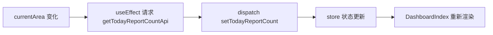

# Java 开发者看 TypeScript 与 React：从一个大屏项目（DashboardIndex）说起

**摘要**：很多 Java 后端在接触前端时会困惑“React到底在干什么”“TypeScript（类型化 JavaScript）和 Java
类型到底像不像”。本文以项目中的 `DashboardIndex` 页面为主线，串起页面结构、状态管理、API（接口）封装与工程化配置，并用 Java
开发者熟悉的概念做对照，帮助你建立可迁移的前端心智模型。

---

## 1. 项目结构：用后端分层思维快速定位

把前端目录当成“后端分层”来看，会更容易理解：

- `src/pages`：页面入口，类似 Controller 的入口层
- `src/components`：通用组件库，类似公共模块/基础组件
- `src/store`：全局状态中心，类似应用级缓存/上下文
- `src/api`：请求封装层，类似 Feign/RestTemplate
- `src/lib`：拦截器/工具集，类似 Filter/AOP

**主线页面：** `src/pages/Dashboard/index.tsx`  
它是“指挥平台”的首页入口，负责：

- 页面类型设置
- 拉取今日上报数
- 组合多块业务组件

## 2. 从 DashboardIndex 看 React 的“状态驱动”思想

在 `DashboardIndex` 中，React 组件是一个函数，它的职责是**根据状态输出 UI（界面）**。  
核心逻辑可以简化为（真实代码略）：

```tsx
useEffect(() => {
    dispatch(setPageType(PageType.dashboard));
}, []);

useEffect(() => {
    if (currentArea?.code) {
        let cancelled = false;
        getTodayReportCountApi({region_code: currentArea.code})
            .then((res) => {
                if (cancelled) return;
                const count = Number(res?.data?.[0]?.cnt ?? 0);
                dispatch(setTodayReportCount(Number.isNaN(count) ? 0 : count));
            })
            .catch(() => {
                if (cancelled) return;
                dispatch(setTodayReportCount(0));
            });
        return () => {
            cancelled = true;
        };
    }
    dispatch(setTodayReportCount(0));
}, [currentArea]);
```

**Java 视角对照：**

- `useEffect`（副作用钩子）≈ 生命周期回调/监听器
- 依赖数组 `[currentArea]` ≈ “当某个状态变化时触发”
- `cancelled` 保护 ≈ “异步回调前先判断对象是否仍有效”

**总结：** React 的更新不是“手动刷新 UI”，而是“更新状态，让 UI 自动变化”。  
这和后端的“请求驱动”不同，更像“状态驱动渲染”。

## 3. TypeScript：像 Java，但更灵活

### 3.1 接口与类型别名

在 `src/types/dashboard.ts` 里：

```ts
export interface ProblemListReturnContext {
    statusKey?: ProblemStatusKey;
    activeKey?: string;
    eventType?: string;
    returnId?: string;
}
```

**对比 Java：**

- Java 的 `interface` 更偏“名义类型”
- TypeScript 的 `interface/type` 更偏“结构化类型”

### 3.2 可选属性与联合类型

在 `src/api/common.ts` 中常见：

```ts
region_code ? : number | string | null;
```

**Java 类比：**
在 Java 中可能用 `Object` + 强制转换或 `Optional`，  
TS 直接在类型层表达“可能是多种类型”，但也要求你更明确地处理空值。

### 3.3 类型断言的边界

`common.ts` 中大量 `as unknown as Promise<...>`：

```ts
return getStatisticsApi(...) as unknown as Promise<{ ... }>;
```

**注意：**  
这类似 Java 的强制类型转换，但 TypeScript 的断言只在编译期生效，运行期不会帮你校验。  
建议只在“API 封装层”使用断言，业务代码尽量消费“已收敛的类型”。

## 4. Redux Toolkit（状态管理工具）：前端也有“状态中心”

`src/store/slice/dashboardSlice.ts`：

```ts
export const dashboardSlice = createSlice({
    name: "dashboardSlice",
    initialState: {...},
    reducers: {
        setTodayReportCount: (state, {payload}) => {
            state.todayReportCount = payload;
        },
        bumpEventListRefreshKey: (state) => {
            state.eventListRefreshKey += 1;
        },
    },
});
```

**Java 视角理解：**

- `initialState` ≈ 初始化配置/默认上下文
- `reducers` ≈ 状态更新方法
- `dispatch(action)` ≈ 统一入口调用（类似 service 层更新状态）

Redux Toolkit 内部使用 Immer（不可变数据助手），  
所以你看到的 `state.xxx =` 并不是“直接可变”，而是由库帮你生成新状态。

**实践建议：**

- 页面级共享数据放 `store`（状态仓库），组件内部临时状态放 `useState`
- 不要把所有数据都塞进全局，避免“全局状态膨胀”

## 5. API 封装：把前端当成“远程服务调用层”

`src/api/common.ts` 封装了通用表格查询接口：

```ts
export function getStatisticsApi(tableId: string, params?: any) {
    const apiUrl = `${window.appConfig.backend}/v1.0/tables/${tableId}/data`;
    return axios({
        url: apiUrl,
        method: "GET",
        params,
    });
}
```

**Java 类比：**

- 类似 `RestTemplate` / `WebClient` 的封装
- 通过统一函数生成 URL、封装请求参数

例如 `getTodayReportCountApi` 在此基础上封装字段：

```ts
export function getTodayReportCountApi(params: {
    region_code: string | number;
    category?: string;
}) {
    const requestParams = {
        region_code: params.region_code,
        ...(params.category ? {category: params.category} : {}),
    };
    return getStatisticsApi(
        TODAY_REPORT_COUNT_TABLE_ID,
        requestParams
    ) as unknown as Promise<{
        success: boolean;
        code: number;
        msg: string;
        data: TodayReportCountRow[];
    }>;
}
```

**总结：**  
前端的 API 层同样需要“统一入口 + 统一返回结构”，否则业务代码会被散乱的请求逻辑污染。

## 6. Axios（HTTP 请求库）拦截器：前端的“拦截器（Filter/Interceptor）”

`src/lib/request.ts` 中构建了统一请求实例：

```ts
const service = axios.create({
    timeout: 300 * 1000,
});
```

请求拦截：

```ts
service.interceptors.request.use((requestConfig: any) => {
    const appId = "dashboard-app";
    requestConfig.headers["appid"] = appId;
    const token = User.access_token;
    if (token) {
        requestConfig.headers.Authorization = `Bearer ${token}`;
    }
    store.dispatch(startLoading());
    return requestConfig;
}, err);
```

响应拦截：

```ts
service.interceptors.response.use((response: any) => {
    store.dispatch(endLoading());
    if (!response.data) {
        if (response.status < 200 && response.status >= 300) {
            throw new Error("执行异常");
        }
        return response;
    }
...
    if (!result.success) {
        if (result.msg) {
            message.error(result.msg);
            throw result.msg;
        }
    ...
    }
    return result;
}, err);
```

**Java 类比：**

- 请求前注入 token（令牌）≈ 认证过滤器
- 错误统一提示 ≈ 全局异常处理
- Loading（加载状态）统一管理 ≈ 请求链路统一埋点

这套机制在前端非常关键，它保证了所有请求行为的一致性。

## 7. 工程化配置：把“运行期配置”还给环境

项目使用 `window.appConfig` 作为运行期配置来源：

```ts
const apiUrl = `${window.appConfig.backend}/v1.0/tables/${tableId}/data`;
```

在拦截器中也会使用 `window.appConfig.baseName` 处理登录跳转路径。  
这相当于后端的 `application.yml` + 环境变量：

- 配置与代码解耦
- 不把真实地址写死进仓库

**额外补充：**
本项目在代码中大量使用 `@/` 作为路径别名，  
这是前端工程化常见实践，便于跨层级引用而不写复杂相对路径。

## 8. 组件组合与样式组织：页面是“组合体”

`DashboardIndex` 页面并不复杂，但它是多个组件组合而成：

- 顶部 `Header`
- 中间 `Middle` 地图区域
- 左右侧业务面板
- 各类弹窗组件（如 `ReportModal`、`DutyCenter`）

这相当于后端“组合多个服务模块输出一个完整业务页面”。  
样式方面，`index.module.less` 采用 CSS Modules（样式模块化），  
避免全局样式污染，类似“每个组件有自己的样式命名空间”。

## 9. Java 工程师常见的前端坑（基于当前代码经验）

1. **异步请求返回晚于组件卸载**
    - 解决：像 `cancelled` 这样的保护必不可少

2. **`null/undefined` 处理不完整**
    - 解决：`res?.data?.[0]?.cnt ?? 0` 这种写法是必要的

3. **类型过度宽松导致失控**
    - 解决：限制 `any` 使用范围，仅在 API 封装边界使用

4. **依赖数组写错导致副作用重复执行**
    - 解决：明确 `useEffect` 的依赖来源

5. **全局状态过度膨胀**
    - 解决：共享才进 `store`，局部状态留在组件内

## 10. 从 Java 迁移到 React 的心智路线

你可以把前端理解为一个“持续运行的客户端应用”，  
不同点在于：**后端以“请求”为中心，前端以“状态”为中心**

### 10.1 Java 与 React/TypeScript 对照表

| Java 后端概念                   | React/TypeScript 概念    | 说明               |
|-----------------------------|------------------------|------------------|
| 控制器（Controller）             | 页面/组件（Page/Component）  | 页面入口负责组织 UI 与数据流 |
| 服务层（Service）                | Hooks（钩子） + 业务组件       | 业务逻辑更贴近组件与状态     |
| DTO（数据传输对象）                 | interface / type（类型定义） | 强类型定义数据形状        |
| 过滤器/拦截器（Filter/Interceptor） | Axios 拦截器              | 统一认证、错误处理、日志     |
| 配置文件（application.yml）       | window 运行期配置           | 环境配置与代码解耦        |

### 10.2 DashboardIndex 的数据流小图

下面用 Mermaid（图表语法）快速画出 DashboardIndex 的关键数据流：



## 11. 结语

TypeScript 和 React 在前端领域形成了一套和后端工程化相似的组织方式。  
当你把“分层、类型、拦截、数据流”这些后端经验迁移到前端时，你会发现两者的核心目标一致：**可维护、可演进、可扩展**。
