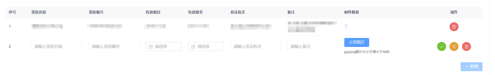

## 问题背景


在这个场景下需要点击一次提交按钮（绿色圆形按钮）即可完成表单的提交与附件的上传

但是element-plus的el-upload组件的上传是对每个附件调用一次“上传请求方法”

那么有没有什么办法能在提交的时候完成附件上传并且将附件的url随着表单返回给后端呢？

## 解决方案

### 逻辑链

1. 点击提交按钮触发表单提交方法
2. 触发图片上传
3. 上传成功回调
4. 上传是对每个附件调用一次上传请求
5. 提交表单

### 代码实现

```
// 表单提交按钮
<el-button
  circle
  icon="Check"
  type="success"
  // 1.点击提交按钮触发表单提交方法
  @click="handleQualificationSave(newRow)"
>

// 表单提交方法
const handleQualificationSave = (newRow) => {
  // 新增行字段验证
  // 验证通过
  // 2.触发图片上传
  // 这里submit触发el-upload组件上传请求
  // 即el-upload的action属性里的url
  imgUploadRef.value!.submit();
};

// 附件上传组件
const imgUploadRef = ref<UploadInstance>()
<el-upload
  ref="imgUploadRef"
  :action="uploadUrl"// 上传地址
  :auto-upload="false"// 关闭自动上传
  :multiple="true"// 允许上传多个文件
  @success="handleImageSuccess"// 3.上传成功回调
>

// 上传成功回调
// @success是action属性里的url成功后的回调
const route = useRoute(); // 获取路由参数
const newRow = reactive({}); // 表单新增行的数据
const uploadedUrls: string[] = []; // 用于存储每个上传文件返回的 URL
let uploadedCount = 0; // 已上传文件数
const handleImageSuccess = (response: UploadResponse, uploadFile, uploadFiles) => {
  // 4.上传是对每个附件调用一次上传请求
  // 所以我拼接上传成功后返回的 URL 作为表单属性attachmentsUrl
  // 当所有附件上传成功后才触发表单提交
  uploadedUrls.push(response.url);
  uploadedCount++;
  if (uploadedCount === uploadFiles.length) {
    newRow.attachmentsUrl = uploadedUrls.join(',');
    newRow.companyId = route.query.id?.toString();
    // 5.提交表单
    qualificationSave(newRow);
  }
}

// 提交表单
const qualificationSave = (row) => {
  // 调用后端接口保存数据
  addQualification(row).then(() => {
    ElMessage.success("信息保存成功");
    // 重新获取数据
    // 清空新增行数据
    ...
  }).catch((error) => {
    ElMessage.error("资质信息保存失败");
  });
};
```

***
##### Simple and Clear(hope so)