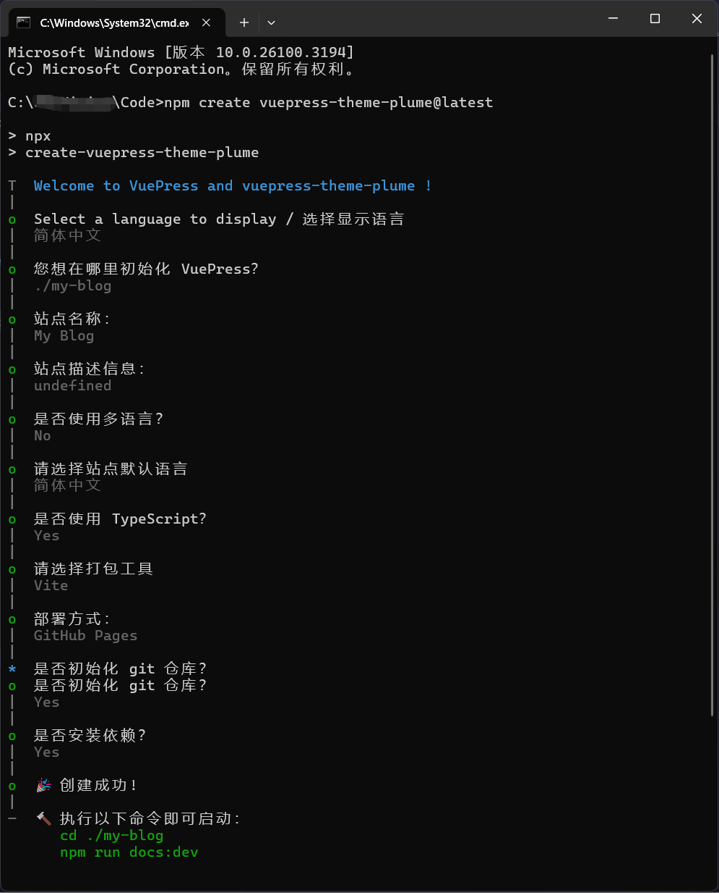
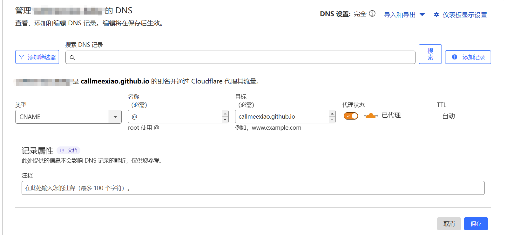
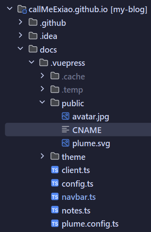
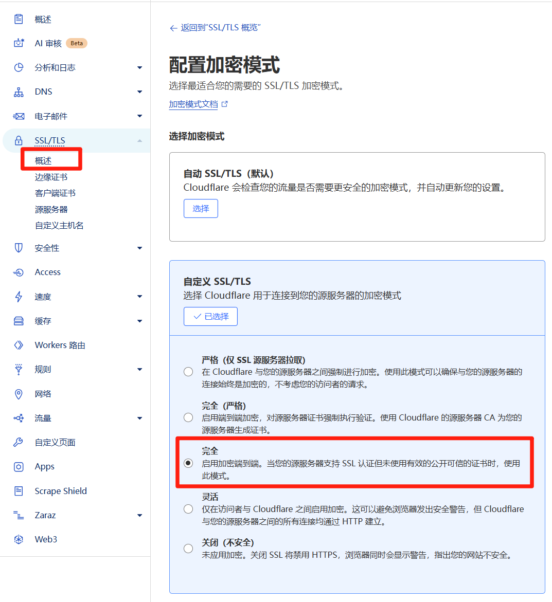

###### [vuepress theme plume](https://theme-plume.vuejs.press/) + [github pages](https://pages.github.com/) + [aliyun](https://www.aliyun.com/) + [cloudflare](https://www.cloudflare-cn.com/)
## 1.搭建
### 1.plume安装&本地启动
[官方文档]((https://theme-plume.vuejs.press/guide/quick-start/))说的很细 这里(应该)不会碰到问题

## 2.部署
### 1.github pages部署
#### 1.[创建仓库](https://github.com/new)
这一步唯一需要注意的是仓库名(Repository name)必须为`{username}.github.io`

这里的`{username}`就是你的github用户名也就是Owner框里显示的内容

仓库可见性是公开还是私有和描述(description)都可以随便填

'Initialize this repository with:Add a README file'这个不用勾选 因为我们直接上传plume初始化的项目
#### 2.本地项目上传
有两种方法上传代码，分别是CMD命令上传和使用IDEA上传（不过本质都是命令行）
##### CMD
打开cmd cd到博客项目根目录 输入以下命令推送博客代码到我们新建的仓库
```bash
:: 提交所有代码到暂存区
git add .
:: 提交代码到本地仓库
git commit -m "plume初始化博客"
:: 本地的 master 分支重命名 main
git branch -M main
:: {username}为你的github用户名,记得改
git remote add origin https://github.com/{username}/{username}.github.io.git
:: 推送代码到远程仓库
git push -u origin main
```
##### IDEA
用idea打开博客项目

在终端输入`git remote add origin https://github.com/{username}/{username}.github.io.git `

最后提交并推送代码就行了
#### 3.访问部署在github pages的博客
在推送代码到github后 我们可以在github仓库的Actions选项卡中查看部署状态

大概在推送代码的一分钟后 就可以访问`{username}.github.io`就可以看到我们的博客了

但因为是部署在github上 所以如果没有梯子的话是访问不了的 这时候我们需要使用CDN加速

注意💡这里不需要备案
### 2.CDN加速
可以在[阿里云注册域名](https://wanwang.aliyun.com/domain)(或者其他注册商自行比价) 然后使用[cloudflare](https://dash.cloudflare.com/)的CDN加速(免费)
#### 1.注册域名
注册登录 -> 挑选域名 -> 购买 -> 实名认证
#### 2.配置cloudflare
a.添加域

注册登录 -> 界面右上角改语言为简体中文 -> 添加域 -> 输入现有域(你注册的域名) -> 选择免费套餐 -> 扫描不到DNS是正常的 因为是新的域名 点继续 
-> 复制 Cloudflare 名称服务器 -> 保存

b.修改DNS服务器

去域名注册商(就是你购买域名的网站)修改DNS服务器

c.添加DNS记录

回到cloudflare添加DNS记录：



d.添加CNAME文件

在博客项目`docs/.vuepress/public/`下新建CNAME文件 内容为你购买的域名 然后提交推送代码


e.SSL/TLS 加密

回到cloudflare配置SSL/TLS，选择“完全”，点击保存


f.访问

访问你购买的域名就可以看到你的博客了