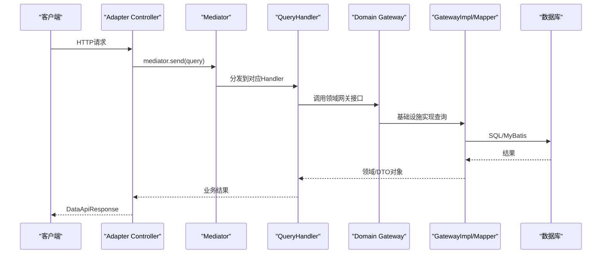
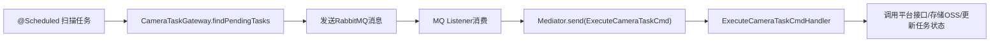

# zjdghy-backend 项目 DDD 架构解读（小白友好版）

> 更新时间：2026-02-08  
> 目标读者：刚接触 DDD、希望看懂本项目分层与术语的人

## 先说结论（TL;DR）

这个项目是一个 **“分层架构 + DDD 思想（部分落地）”** 的工程，不是教科书式“纯 DDD”，但已经有很清晰的 DDD 轮廓：

- 模块上分成 `start` / `adapter` / `application` / `domain` / `infrastructure` 五层。
- 交互上大量采用 `Cmd/Query + Handler + Mediator`，把控制器和业务逻辑解耦。
- 领域层有网关接口（`*Gateway`），基础设施层有实现（`*GatewayImpl`），体现依赖倒置。
- 领域模型里既有“充血模型”案例，也有“贫血模型”案例，属于演进中的真实项目状态。

## 对外发布脱敏说明（建议保留）

如果这篇文章用于公开平台（公众号/掘金/知乎），建议按以下规则脱敏：

- **包名/组织名脱敏**：`com.xxx` 统一替换为 `com.example`。
- **项目名脱敏**：真实仓库名替换为 `project-a` 或 `sample-backend`。
- **外部系统脱敏**：第三方平台名、队列名、桶名、域名统一用 `A系统/B系统` 代替。
- **数据库信息脱敏**：表名可保留语义但避免暴露真实命名规范（如前缀规则、租户标识）。
- **配置脱敏**：URL、Token、账号、密钥、内网地址必须全部替换为占位符。

本文中的“代码片段”已按通用命名表达业务思想，避免依赖真实项目细节。

---

## 我是怎么判断的（说明与假设）

本文基于仓库代码静态分析，重点参考了以下文件：

- 根模块与依赖：`pom.xml`
- 各模块依赖：
  - `zjdghy-backend-start/pom.xml`
  - `zjdghy-backend-adapter/pom.xml`
  - `zjdghy-backend-application/pom.xml`
  - `zjdghy-backend-domain/pom.xml`
  - `zjdghy-backend-infrastructure/pom.xml`
- 典型链路样例：
  - `zjdghy-backend-adapter/src/main/java/com/ptkj/controller/fo/IndicatorsController.java`
  - `zjdghy-backend-application/src/main/java/com/ptkj/cameratask/task/CameraTaskScheduler.java`
  - `zjdghy-backend-application/src/main/java/com/ptkj/cameratask/ExecuteCameraTaskCmdHandler.java`
  - `zjdghy-backend-domain/src/main/java/com/ptkj/cameratask/CameraTask.java`
  - `zjdghy-backend-domain/src/main/java/com/ptkj/cameratask/gateway/CameraTaskGateway.java`
  - `zjdghy-backend-infrastructure/src/main/java/com/ptkj/cameratask/gatewayimpl/CameraTaskGatewayImpl.java`
  - `zjdghy-backend-infrastructure/src/main/resources/mybatis/CameraTaskMapper.xml`

---

## 1. 先看架构全景（模块维度）

根 `pom.xml` 是 Maven 多模块工程，模块如下：

- `zjdghy-backend-start`：Spring Boot 启动与装配
- `zjdghy-backend-adapter`：HTTP/WebSocket 接口适配层
- `zjdghy-backend-application`：应用编排层（命令/查询处理、任务、监听）
- `zjdghy-backend-domain`：领域模型、网关接口、业务枚举
- `zjdghy-backend-infrastructure`：DB/MQ/外部系统等技术实现层

一句话理解：

**用户请求先到 adapter，业务由 application 编排，核心概念在 domain，具体落地在 infrastructure，最后由 start 启动所有组件。**

---

## 2. 项目里的典型调用链

### 2.1 HTTP 查询链路（以指标查询为例）



对应代码可看：

- Controller：`.../IndicatorsController.java`
- Handler：`.../FoXzqIndicatorsWarningSummaryQueryHandler.java`
- Gateway 接口：`.../foindicators/gateway/FoXzqIndicatorsGateway.java`
- Gateway 实现：`.../foindicators/gatewayimpl/FoXzqIndicatorsGatewayImpl.java`

### 2.2 定时任务 + MQ + 命令链路（以摄像头任务为例）



对应代码可看：

- 调度：`.../cameratask/task/CameraTaskScheduler.java`
- 消费：`.../cameratask/listener/CameraTaskMessageListener.java`
- 命令处理：`.../cameratask/ExecuteCameraTaskCmdHandler.java`

---

## 3. 每一层到底干什么（带项目映射）

### 3.1 Adapter（接口适配层）

职责：接协议、做入参校验、组装命令/查询、返回统一响应。

特征：

- `@RestController + /api/...`
- DTO 放在 `controller/dto`
- 常见 `@Valid` 校验
- 通过 `mediator.send(...)` 进入应用层

样例：

- `zjdghy-backend-adapter/src/main/java/com/ptkj/controller/FlowCommentsTemplateController.java`
- `zjdghy-backend-adapter/src/main/java/com/ptkj/controller/dto/SaveFlowCommentsTemplateRequest.java`

### 3.2 Application（应用层）

职责：业务流程编排，不直接关心底层技术细节。

常见内容：

- `*Cmd` / `*Query`（用例输入）
- `*CmdHandler` / `*QueryHandler`（用例处理）
- `task`（定时任务）
- `listener`（消息监听）

样例：

- `zjdghy-backend-application/src/main/java/com/ptkj/workflow/comments/SaveFlowCommentsTemplateCmdHandler.java`
- `zjdghy-backend-application/src/main/java/com/ptkj/cameratask/ExecuteCameraTaskCmdHandler.java`

### 3.3 Domain（领域层）

职责：沉淀业务概念、规则和抽象。

在这个项目里主要包含：

- 领域模型（如 `CameraTask`、`AlarmSummary`）
- 领域网关接口（`*Gateway`）
- 领域枚举、少量领域规则（如 `FoIndicatorWarningEvaluator`）

样例：

- `zjdghy-backend-domain/src/main/java/com/ptkj/cameratask/CameraTask.java`
- `zjdghy-backend-domain/src/main/java/com/ptkj/cameratask/gateway/CameraTaskGateway.java`

### 3.4 Infrastructure（基础设施层）

职责：把 domain 的抽象落到技术实现。

在这个项目里常见为：

- `*GatewayImpl`（实现 domain 网关）
- `*Mapper`、`*DO`、`mybatis/*.xml`
- 对接 MQ、OSS、第三方 API

样例：

- `zjdghy-backend-infrastructure/src/main/java/com/ptkj/cameratask/gatewayimpl/CameraTaskGatewayImpl.java`
- `zjdghy-backend-infrastructure/src/main/resources/mybatis/CameraTaskMapper.xml`

### 3.5 Start（启动层）

职责：Spring Boot 启动、配置装配。

样例：

- `zjdghy-backend-start/src/main/java/com/ptkj/Application.java`

---

## 4. DDD 术语词典（结合本项目解释）

下面是你写博客时最常被问到的术语，我用“定义 + 本项目例子”解释。

### 4.1 DDD（领域驱动设计）

- 定义：先围绕业务领域建模，再让代码结构服务于业务模型。
- 本项目理解：包名、类名大量按业务域组织（如 `cameratask`、`workflow`、`fo`）。

### 4.2 统一语言（Ubiquitous Language）

- 定义：产品、业务、研发说同一套词，避免“需求叫A，代码叫B”。
- 本项目例子：`CameraTask`、`WarningStrategy`、`FlowInstance` 等业务词直接进入代码。

### 4.3 限界上下文（Bounded Context）

- 定义：某个业务模型适用的边界，不同上下文可对同一词有不同含义。
- 本项目可视角：`workflow`、`fo.warninginfo`、`cameratask` 都可视作上下文候选。

### 4.4 实体（Entity）

- 定义：有唯一标识（ID）、生命周期可持续演化的对象。
- 本项目例子：`CameraTask`、`AlarmSummary`。

### 4.5 值对象（Value Object）

- 定义：靠“值”而不是“ID”区分，通常不可变，适合表达一段业务语义。
- 本项目现状：有 `VO/DTO` 命名对象（如 `ClueListVO`），但“严格值对象”模式还不算突出。

### 4.6 聚合（Aggregate）与聚合根（Aggregate Root）

- 定义：一组需要强一致性维护的对象集合；对外只通过“聚合根”访问。
- 本项目观察：已经有“按领域对象 + 网关”组织方式，但“显式聚合边界”标识还偏弱。

### 4.7 领域服务（Domain Service）

- 定义：不适合放到某个实体里的领域规则（通常跨实体/跨聚合）。
- 本项目例子：`FoIndicatorWarningEvaluator` 承担了指标预警规则计算。

### 4.8 应用服务（Application Service）

- 定义：负责流程编排、事务、权限、调用多个领域能力，不承载核心领域知识。
- 本项目例子：`FoWarningInfoWorkflowAppService` 编排了流程推进、事件发布、外部副作用。

### 4.9 仓储（Repository）/ 网关（Gateway）

- 定义：屏蔽存储和外部系统细节，领域层只依赖抽象。
- 本项目落地：接口在 domain（如 `CameraTaskGateway`），实现在 infrastructure（`CameraTaskGatewayImpl`）。

### 4.10 领域事件（Domain Event）

- 定义：描述“领域里已经发生的事实”。
- 本项目例子：`WarningStatusChangedEvent`。

### 4.11 防腐层（ACL, Anti-Corruption Layer）

- 定义：对接外部系统时做转换与隔离，避免外部模型污染内部模型。
- 本项目例子：多个 `GatewayImpl` 在做第三方/数据库协议转换，本质就在承担防腐层职责。

### 4.12 贫血模型（Anemic Model） vs 充血模型（Rich Model）

这是你特别关心的点，单独展开：

#### 贫血模型（Anemic Model）

- 特征：类里主要是字段 + getter/setter，业务规则在 Service/Handler。
- 优点：上手快、改动直接。
- 缺点：规则分散，难维护，容易“哪里都能改状态”。
- 本项目例子：`AlarmSummary`、`Tree` 以数据承载为主，行为较少。

#### 充血模型（Rich Model）

- 特征：对象自己封装状态变化规则，提供业务行为方法。
- 优点：规则内聚、可读性和可维护性更好。
- 缺点：设计门槛更高，需要明确边界与不变量。
- 本项目例子：`CameraTask` 已有较明显的行为方法：
  - `isActive()`
  - `updateExecResult(...)`
  - `markCompleted()/markFailed()/resetToPending()`
  - `retryFailedTask()`
  - `calculateNextExecTime()`

#### 为什么叫“充血”与“贫血”？（术语来源）

这两个词是医学隐喻：

- “血”在医学里代表营养与活力；
- 在 DDD 里，“血”类比业务规则与行为能力；
- 所以：
  - **贫血模型**：对象里主要只有字段（像“只有骨架”），业务规则大量外置到 Service/Handler；
  - **充血模型**：对象既有字段也有行为（像“有血有肉”），能在对象内部维护状态变更和业务约束。

可以记成一句话：

**“数据 + 行为同居”是充血；“数据在实体、行为在服务”是贫血。**

#### 一段可直接放博客的对比示例

下面用“任务失败后重置待执行”举例：

贫血写法（规则在 Service）：

```java
// Entity 只有字段
job.setStatus(JobStatus.PENDING);
job.setNextRunAt(job.getLastRunAt().plusHours(1));
job.setUpdatedAt(Instant.now());
jobRepository.save(job);
```

充血写法（规则在模型）：

```java
// Entity 内部封装规则
job.retryAfterFailure();
jobRepository.save(job);
```

为什么后者更好：

- 规则只写一处，避免多个 Service 各写一版；
- 语义更清晰（方法名就是业务动作）；
- 后续规则变化（比如从 +1 小时改成按策略计算）只改模型内部。

一句话总结：

**这个项目是“贫血 + 充血并存”的过渡态，且正朝更充血的方向演进。**

---

## 5. 这个项目“DDD 落地程度”怎么评价？

我给的判断是：**DDD-Lite 到 DDD-中级演进期**。

### 已经做得不错的地方

- 模块边界清晰，多模块划分符合分层思想。
- `Cmd/Query + Handler` 让用例边界清楚。
- 网关接口与实现分离，依赖倒置方向基本正确。
- 实战里把定时任务、MQ、外部接口纳入同一业务链路，工程化成熟度不错。

### 仍有“非纯 DDD”痕迹（真实项目常见）

- `application` 模块仍直接依赖 `infrastructure`（模块 `pom` 里也有注释说明是过渡态）。
- 领域层中部分对象偏 DTO 风格，聚合根边界还不够显式。
- 领域模块里可见少量 Spring 工具类依赖，说明“纯领域隔离”尚未完全做到。

这不是“好坏”问题，而是 **架构演进阶段** 问题。

---

## 6. 如果你要写博客，可以这样下标题

可选标题：

1. 《我在真实项目里读懂 DDD：从贫血模型到充血模型》
2. 《五层模块 + Cmd/Query：一个 Java 后端的 DDD 实战拆解》
3. 《不是教科书，但很好用：zjdghy-backend 的 DDD 架构解读》

---

## 7. 你后续可以继续补充的两块（建议）

1. **补一张“目录到分层”的图**：让读者 10 秒看懂项目结构。  
2. **补一条“从 Controller 到 SQL 的真实调用链”**：读者最有代入感。

---

## 8. 给你的“一句话记忆法”

**DDD 不是为了把代码写复杂，而是为了让“业务规则有家可回”。**

在这个项目里，这个“家”正在从“服务里到处散落”，逐步迁到“领域模型与网关抽象”中。
