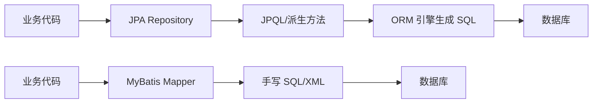

# JPA vs MyBatis：一篇讲透选型与落地的实战教程

## 先说结论

如果你时间有限，只看这一段：

- **复杂 SQL 多、报表多、数据库方言特性重（如 PostgreSQL `jsonb`）**：优先 MyBatis（或 MyBatis-Plus）。
- **标准 CRUD 多、领域关系清晰、希望快速开发**：优先 JPA（Spring Data JPA）。
- **大多数中大型项目最终是混用**：核心复杂查询用 MyBatis，简单聚合读写用 JPA。

这不是“谁更先进”的问题，而是“谁更匹配你的业务形态”。

---

## 1. 两者本质差异：ORM vs SQL Mapper

- **JPA（ORM）**：你主要操作“对象”，框架帮你生成和管理 SQL。
- **MyBatis（SQL Mapper）**：你主要操作“SQL”，框架帮你做参数绑定和结果映射。



一句话理解：
- JPA 追求“**面向对象开发效率**”。
- MyBatis 追求“**面向 SQL 的可控性**”。

---

## 2. 9 个维度对比（教学版）

| 维度 | JPA | MyBatis / MyBatis-Plus | 选型建议 |
|---|---|---|---|
| 学习曲线 | 要理解实体状态、懒加载、脏检查 | 要理解 SQL/索引/执行计划 | 初学 CRUD 选 JPA；要深控性能选 MyBatis |
| CRUD 开发效率 | 非常高（`JpaRepository`） | 中等（MP 可提高） | 标准增删改查：JPA 更快 |
| 复杂查询表达 | 复杂时常回退 `nativeQuery` | 天然强项，SQL 直写 | 报表/统计/复杂 join：MyBatis |
| 动态条件查询 | Specification/Criteria 类型安全 | XML `if/where/trim` 直观 | 团队习惯决定，MyBatis 更“所见即所得” |
| 数据库方言能力 | 依赖 ORM 支持，方言越重越麻烦 | 方言可直接用 | `jsonb`/窗口函数/CTE：MyBatis |
| 性能可观测性 | 需额外关注隐式 SQL、N+1 | SQL 显式可见 | 强调可观测与调优：MyBatis |
| 事务模型 | 与 Spring `@Transactional` 深度融合 | 同样可用 Spring 事务 | 两者都行，关键是边界规范 |
| 架构耦合 | 容易把 Entity 暴露到业务层 | 天然偏“防腐层”思想 | DDD 场景更容易守住边界 |
| 团队维护成本 | 快，但要有 ORM 经验防坑 | 稳，但 SQL 规范必须统一 | 按团队基因选择，不要盲目“统一” |

---

## 3. 四组代码示例（最关键）

> 下面示例是教学代码，重点看“表达方式差异”。

### 3.1 场景 A：动态条件查询

#### MyBatis（XML 动态 SQL）

```xml
<select id="findByCondition" resultType="WarningStrategyDO">
  SELECT * FROM gsmm_warning_strategy
  <where>
    <if test="treeId != null and treeId != ''">
      AND tree_id = #{treeId}
    </if>
    <if test="eventType != null and eventType != ''">
      AND event_type = #{eventType}
    </if>
    AND is_deleted = false
  </where>
</select>
```

#### JPA（Specification）

```java
public interface WarningStrategyRepository extends JpaRepository<WarningStrategyEntity, String>,
        JpaSpecificationExecutor<WarningStrategyEntity> {
}

public static Specification<WarningStrategyEntity> byCondition(String treeId, String eventType) {
    return (root, query, cb) -> {
        List<Predicate> predicates = new ArrayList<>();
        if (treeId != null && !treeId.isBlank()) {
            predicates.add(cb.equal(root.get("treeId"), treeId));
        }
        if (eventType != null && !eventType.isBlank()) {
            predicates.add(cb.equal(root.get("eventType"), eventType));
        }
        predicates.add(cb.isFalse(root.get("isDeleted")));
        return cb.and(predicates.toArray(Predicate[]::new));
    };
}
```

**教学点评**：
- MyBatis 更像“拼 SQL 句子”；
- JPA 更像“拼查询对象”；
- 简单场景都好用，但复杂条件下 MyBatis 调试通常更直接。

---

### 3.2 场景 B：复杂报表（CTE + 聚合）

#### MyBatis

```xml
<select id="selectMonthlyWarningStats" resultType="MonthlyWarningStatsDTO">
  WITH sub_regions AS (...),
       monthly_warnings AS (...),
       detailed_data AS (...)
  SELECT ...
  UNION ALL
  SELECT ...
</select>
```

#### JPA（一般会用原生 SQL）

```java
public interface FoWarningInfoRepository extends Repository<FoWarningInfoEntity, String> {

    interface MonthlyWarningProjection {
        String getXzqDm();
        String getCityName();
        Long getTotalCount();
        Long getDisposedCount();
        BigDecimal getDisposalRate();
    }

    @Query(value = """
        WITH sub_regions AS (...),
             monthly_warnings AS (...)
        SELECT ...
        """, nativeQuery = true)
    List<MonthlyWarningProjection> selectMonthlyWarningStats(@Param("xzqDm") String xzqDm,
                                                             @Param("eventType") String eventType);
}
```

**教学点评**：
- 这类查询 JPA 最终也常常“回到 SQL”。
- 如果你的核心价值在复杂查询，MyBatis 的心智模型更稳。

---

### 3.3 场景 C：PostgreSQL `jsonb` 字段映射

#### MyBatis（TypeHandler）

```java
@TableField(value = "original_image", typeHandler = JsonbTypeHandler.class)
private List<Object> originalImage;
```

```xml
#{condition.originalImage, jdbcType=OTHER}::jsonb
```

#### JPA（Hibernate 6 示例）

```java
@Entity
@Table(name = "gsmm_warning_info")
public class WarningEntity {

    @Id
    private String id;

    @JdbcTypeCode(SqlTypes.JSON)
    @Column(name = "original_image", columnDefinition = "jsonb")
    private List<Object> originalImage;
}
```

**教学点评**：
- 两者都能做，但 MyBatis 对方言控制更“显式”。
- 如果你大量使用数据库特性，MyBatis 更少“黑盒感”。

---

### 3.4 场景 D：DDD 分层下如何防止 ORM 污染领域

无论你选 JPA 还是 MyBatis，都建议：
- `domain` 层定义 `Gateway` 接口；
- `infrastructure` 层实现具体持久化；
- 不让 Entity/DO 直接泄漏到应用层与领域层。

```java
// domain
public interface WarningStrategyGateway {
    List<WarningStrategy> findByTreeId(String treeId);
}

// infrastructure (JPA or MyBatis 都可以是实现细节)
@Service
@RequiredArgsConstructor
public class WarningStrategyGatewayImpl implements WarningStrategyGateway {
    @Override
    public List<WarningStrategy> findByTreeId(String treeId) {
        // 查询 + 转换
        return List.of();
    }
}
```

**教学点评**：
- 架构边界比 ORM 选择更重要。
- 好边界可以让你将来低风险替换持久化方案。

---

## 4. 常见误区（面试和实战高频）

### 误区 1：JPA 一定比 MyBatis 慢
不绝对。慢的通常是“错误使用方式”，如 N+1、过度懒加载、无索引。

### 误区 2：MyBatis 一定更难维护
也不绝对。若 SQL 规范、分层、命名统一，维护性可以很好。

### 误区 3：全项目必须统一一种技术
真实工程里，**按场景混用**往往是最优解。

### 误区 4：选了 JPA 就不写 SQL
复杂查询、统计报表、方言特性场景，JPA 也常要写原生 SQL。

---

## 5. 一套可执行的选型清单（建议收藏）

你可以逐条打勾：

- 是否有大量复杂 SQL / 报表 / CTE / `jsonb`？
- 是否需要精细控制 SQL 与执行计划？
- 团队是否更擅长 SQL 还是 ORM？
- 业务模型是否稳定、主要是 CRUD？
- 是否允许一部分模块先试点，再逐步推广？

**决策模板**：
- 复杂查询模块：MyBatis（可配 MyBatis-Plus 提升 CRUD 效率）
- 标准 CRUD 模块：JPA
- 统一边界：都走 Gateway，避免技术细节外泄

---

## 6. 给团队的渐进式落地策略

### 第一步：先定边界，再定框架
- 先统一 DTO / Domain / Gateway 边界。
- 再决定每个模块用 JPA 还是 MyBatis。

### 第二步：从新增模块试点
- 不要立刻重构全量历史代码。
- 新模块按“复杂度”选型，积累真实数据。

### 第三步：建立治理规则
- JPA：禁止无脑 `EAGER`，关注 N+1。
- MyBatis：统一 SQL 命名与分页规范，沉淀复用片段。

### 第四步：用指标说话
- 对比开发效率、接口 RT、慢 SQL、故障率。
- 每月复盘一次，动态调整策略。

---

## 7. 结语

JPA 和 MyBatis 不是对立关系，而是工具箱里的两把扳手。

- 你要的是**更快交付**，就让简单场景更快（JPA）。
- 你要的是**更强可控**，就让复杂场景更稳（MyBatis）。
- 真正的工程能力，是“按场景选工具 + 用架构隔离变化”。

---

## 参考资料（官方）

- Spring Data JPA 文档：
  - [https://github.com/spring-projects/spring-data-jpa/blob/main/src/main/antora/modules/ROOT/pages/jpa/query-methods.adoc](https://github.com/spring-projects/spring-data-jpa/blob/main/src/main/antora/modules/ROOT/pages/jpa/query-methods.adoc)
- MyBatis 动态 SQL：
  - [https://github.com/mybatis/mybatis-3/blob/master/src/site/markdown/dynamic-sql.md](https://github.com/mybatis/mybatis-3/blob/master/src/site/markdown/dynamic-sql.md)
- MyBatis-Plus 文档：
  - [https://github.com/baomidou/mybatis-plus-doc](https://github.com/baomidou/mybatis-plus-doc)
