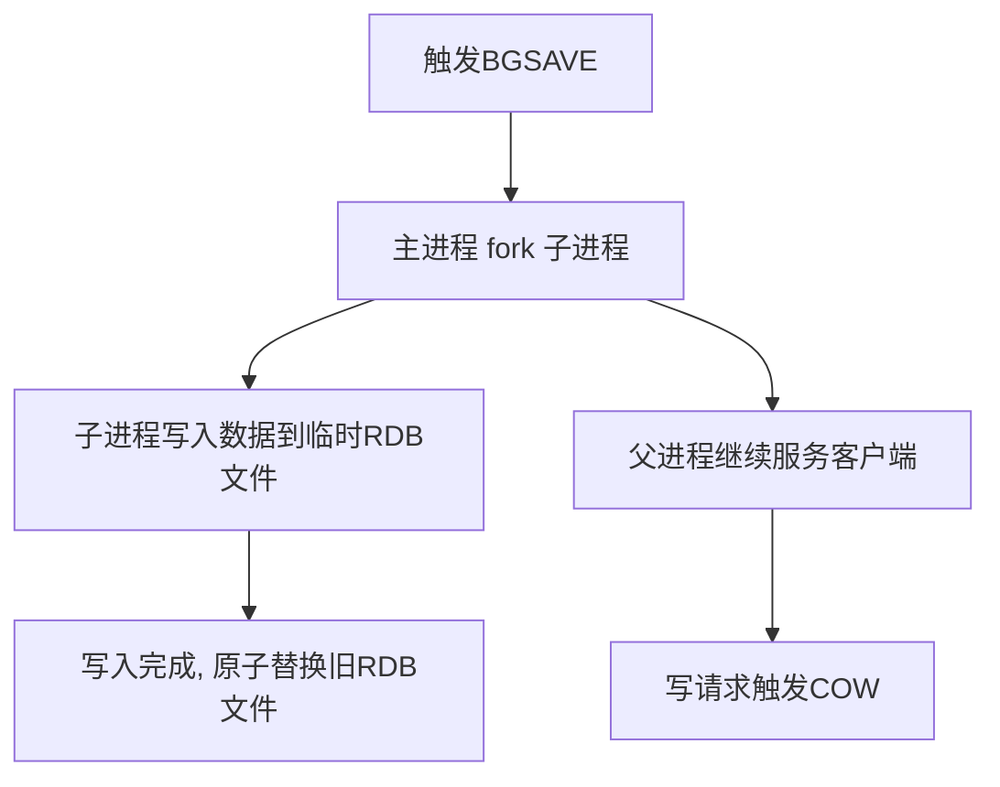
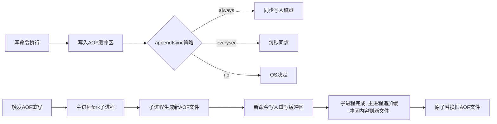

OK Let's Dive in!🤿

## Redis 为什么快

### 内存操作

🔴访问内存 (DRAM) vs 访问磁盘 (SSD/HDD) 的速度差异是 100ns vs 100us vs 10ms (10 万倍差距)。这是 Redis 速度的物理基础。

⚫当数据全在内存后，瓶颈就从磁盘 I/O 变成了网络 I/O和CPU 处理能力。这也是 Redis 设计核心逻辑集中在网络和 CPU 效率优化的原因。

⚫内存掉电数据即失，引出持久化问题。

⚫内存比磁盘贵得多，限制了数据集大小。

### 单线程模型

纯单线程模型： 所有核心操作都在一个线程内完成：

- 监听网络连接 (bind, listen, accept)
- I/O 多路复用 (epoll/kqueue/select 事件循环)
- Socket 数据读写
- Redis 协议解析与请求构造
- 命令查找、参数解析、执行
- 内存数据结构操作
- 生成响应、写入 Socket
- 过期 Key 扫描（部分逻辑）
- RDB/AOF 持久化 fork 操作（bgsave, bgrewriteaof 由主线程 fork，但持久化本身在子进程）

🔴单线程模型避免了多线程的上下文切换和锁的开销。

- 锁竞争： 多线程环境下，共享数据结构需要锁保护（如全局哈希表）。锁的获取、释放、等待在高并发时消耗巨大 CPU，且极易引发性能瓶颈和复杂
  bug。
- 上下文切换： 线程数 > CPU 核数时，操作系统频繁切换线程执行，保存 / 恢复寄存器状态、更新内核数据结构等操作消耗可观 CPU 时间。
- 设计哲学：简单、高效、可控。 单线程消除了线程安全问题，让内部实现（如数据操作、事件处理）变得极其清晰和可预测。

⚫单线程吞吐量存在理论上限（取决于单核性能和网络带宽）

⚫单个命令计算不能并行加速（这是引入网络 I/O 线程的根本原因）。

⚫长命令阻塞： 任何耗时操作（如KEYS *, FLUSHALL) 或大 Key 操作（如读 / 写一个包含百万字段的
Hash），都会阻塞整个实例，导致所有后续请求延迟飙升。这是单线程模型与生俱来的问题。

- 绝对禁用 KEYS → 使用 SCAN 增量迭代。
- 避免大 Key → 拆分数据结构（如大 Hash 按字段 Hash 分桶）。
- 避免大 Value → 压缩数据（如使用 GZIP 压缩）。
- 查询优化 → HSCAN 替代 HGETALL，ZRANGE ... LIMIT 替代取全量。
- 合理使用管道 → 减少网络 RTT 次数，一次批处理多个命令，提升单线程利用率。

### I/O 多路复用(epoll)

"I/O 多路复用" 技术，就是一种让单线程（或少量线程）能够通过高效监控机制，同时管理服务大量网络连接（进行 I/O 操作）的方法，其核心精髓在于
共享使用操作系统提供的高效事件监控能力（epoll）以及有限的 CPU 线程资源，从而实现高并发、高效率。

- 复用 OS 事件监控机制： 内核一次系统调用epoll_wait可以报告多个连接的多个事件，不用每个连接单独查状态。
- 复用 CPU 线程时间： 线程只在有真实的 I/O 工作要做时才被唤醒执行，避免在等待 I/O 上浪费 CPU。沉睡时 CPU 可 “复用” 于其他任务。
- 复用同一套处理逻辑： 同一个线程按序处理所有就绪连接的 I/O 操作。

#### 技术实现

使用 epoll 实现 I/O 多路复用，支持海量连接。同时也是目前 Linux 上最高效的 I/O 多路复用机制。它提供了三个关键系统调用：

1. epoll_create：创建一个 epoll 实例，返回一个文件描述符(fd)指向内核中的 epoll 实例。。
2. epoll_ctl(epfd, op, fd, event)：向 epoll 实例添加、修改或删除文件描述符。（ 在连接生命周期中调用次数少，只在 fd
   状态改变时调用，如新连接加入、修改监听事件、关闭连接时删除 ）
    - epfd：epoll_create 返回的 fd。
    - op：操作类型（EPOLL_CTL_ADD 添加，EPOLL_CTL_MOD 修改，EPOLL_CTL_DEL 删除）。
    - fd：要操作的 Socket fd。
    - event：关心的事件（EPOLLIN 有数据可读，EPOLLOUT 可写，EPOLLET 边缘触发模式）。
3. epoll_wait(epfd, events, maxevents, timeout)：等待文件描述符上的事件。
    - epfd：epoll 实例 fd。
    - events：一个数组，由 epoll_wait 填充发生的事件（哪些 fd 有需求）。
    - maxevents：events 数组的大小（一次最多拿多少通知）。
    - timeout：超时时间（最多等多久，-1 表示无限等待）。
    - 返回值： 就绪事件列表。
    - 核心优势： 内核将就绪事件列表通过 events 直接返回给用户空间。避免全量扫描 fd 集合，复杂度 O (1) 或 O (就绪的 fd 数)。

#### 触发模式

##### 水平触发 (Level-Triggered, LT) - Redis 5.0 默认

只要 fd 满足监听的条件（如接收缓冲区有数据未读完），每次调用 epoll_wait 都会通知。

🔴编码简单安全。应用程序只需关心读 / 写操作即可，不用一次性处理完所有数据。

⚫可能会多次通知同一个事件（如果程序不处理完）。

##### 边缘触发 (Edge-Triggered, ET)

只在 fd 状态变化时通知一次（如接收缓冲区从空变为非空）。后续即使缓冲区还有数据未读完，只要没有新数据到达（状态再次变化），就不再通知。

🔴理论上通知次数更少，性能略优。

⚫编程复杂度高， 应用必须在收到通知后，非阻塞地循环读 / 写 Socket，直到系统调用返回 EAGAIN 或
EWOULDBLOCK（表示暂时没有数据可读或发送缓冲区满），否则会遗漏事件。 更容易出错，可能导致数据读取不全或饿死（忘记处理导致认为
fd 没事了）。

#### 高效内核

1. 红黑树 (Red-Black Tree)
    - 内核用红黑树组织 epoll_ctl 注册的所有 fd（高效支持 ADD, MOD, DEL 操作，O (log n)）。
    - 解决 select/poll 中内核需线性扫描的问题。
2. 就绪链表 (Ready List)
    - 当 fd 状态变化（有事件就绪）时，内核中断处理程序将其插入一个就绪链表中（而不是立即通知用户）。
    - epoll_wait 只需检查这个链表是否有节点即可（近乎 O (1)）。
3. 回调机制 (Callback)
    - 内核为每个注册的 fd 关联一个回调函数。
    - 当 fd 的 I/O 状态发生变化时（如网卡数据到达填入接收缓冲区），中断处理会触发回调函数。
    - 回调函数的工作：检查这个变化是否让 fd 产生了我们关心的事件？如果是，就把该 fd 插入就绪链表。

### 数据结构

Redis 5.0 的数据结构优化已基本成熟。它们不仅提供了丰富的语义（String, Hash, List, Set, Sorted Set
等），更在内存使用和操作效率之间找到了精妙的平衡，完美服务于 Redis 的单线程内存数据库场景。核心设计概念：

1. 内存预分配 & 惰性释放 (String - SDS)
    - 内存预分配： 当字符串需要扩容时（如 APPEND），Redis 不仅分配当前所需空间，还会额外多分配一些备用空间（策略：新长度 <1MB
      则加倍，>=1MB 则加 1MB）。目的是减少后续再次扩容的系统调用次数。
    - 惰性释放： 当字符串被缩短（如 SETRANGE 写 0），Redis 只修改长度标识 len，不会立即释放多出来的物理内存。这些空间保留给后续可能增长的操作复用。
2. 双编码策略 & 自动转换 (Hash / Set / Sorted Set)
    - 双编码策略： Redis 为同一数据类型提供不同底层实现（编码 Encoding）。例如 Hash 使用：
        - ziplist（压缩列表） - 内存优先：内存紧凑的线性结构，适合字段少 / 值小的场景。
        - hashtable（哈希表） - 性能优先：散列表结构，适合字段多 / 读写频繁的大对象。
    - 自动转换： Redis 在后台监控数据规模和属性。当对象增长超过配置阈值（如 hash-max-ziplist-entries / value），或数据类型发生变化（如
      Set 中存入字符串），Redis 会 自动、静默地转换底层编码。
3. 索引联合 (Sorted Set - SkipList + Dict)
    - SkipList (跳表)： 一种多层链表结构。高层链表是低层的 “快速通道”（类似地铁快线）。按分数 (Score)
      有序排列，支持高效的范围查询（ZRANGEBYSCORE、ZRANK）。
    - Dict (字典 / 哈希表)： 存储 元素 (member) 到分数 (score) 的直接映射。
    - 联合： Sorted Set 在底层同时维护跳表和字典。跳表解决排序和范围操作，字典解决单点快速查找。
4. 概率算法 (HyperLogLog)

   牺牲精确性换空间。在对精度要求不苛刻的统计场景下（如趋势分析、大规模 UV 统计），用极小且固定的空间开销解决了海量数据的基数估算难题。

5. 分块链表 (List - QuickList)
    - Ziplist 的局限性： 内存连续、省内存，但插入 / 删除中间元素效率低（需要移动数据）。
    - Linkedlist 的局限性： 插入 / 删除快（O (1)），但每个元素需额外存储前后指针（每个节点多 16~24 字节），内存碎片多。
    - Quicklist：将多个小的 Ziplist 用双向链表串起来。每个 Ziplist 节点包含多个元素。
    - 动态调整： 节点大小可配置 (list-max-ziplist-size)。插入可能导致节点分裂，删除可能导致节点合并。

#### 字符串 (String)

最基本类型，可存储文本、二进制数据、整数、浮点数。最大 512MB。

核心设计：

- Strlen：Strlen 命令用于获取指定 key 所储存的字符串值的长度。当 key 储存的不是字符串值时，返回一个错误。
- 内存预分配：每次分配内存时会高出实际字符串的length（长度 <1MB 则加倍，>=1MB 则加 1MB），避免频繁的小幅度内存分配和缓冲区溢出风险。
- 惰性释放：缩短字符串后，多出来的空间先留着不立刻还给系统，下次扩容可能直接用上，减少系统调用。

应用场景：

- 数据缓存：缓存用户信息（JSON 字符串）、商品详情
   ```redis
   SET user:1001 '{name:"Lucy", age:28}' EX 300
   ```
- 计数器：秒杀库存、文章阅读量
   ```redis
   INCR article:1001:views → 利用整数编码省内存
   ```
- 分布式锁：利用原子性实现互斥
   ```redis
   SET lock_key unique_value NX EX 30
   ```
- 限流器：滑动窗口计数（INCR + EXPIRE）

#### 列表 (List)

有序元素集合，可重复。支持头尾高效插入 / 删除 (LPUSH/RPUSH, LPOP/RPOP)，中间相对低效。

核心设计：

- Quicklist（链表 + 小型压缩列表）：平衡头尾操作效率与内存消耗
- list-max-ziplist-size：限制单个节点大小防止连锁更新

典型场景：

- 消息队列：简易版任务队列（生产消费模型）
   ```redis
    生产者 LPUSH task:queue job_data
    消费者 RPOP task:queue
   ```
- 时间线：微信朋友圈动态
   ```redis
    LPUSH user:1001:timeline "新动态内容"（新内容插头部）
  ```
- 最新商品列表：电商首页推荐最新 50 个商品
   ```redis
    LTRIM hot_products 0 49 裁剪旧数据
  ```
- 阻塞队列：**BRPOP** 实现消息阻塞获取

#### 哈希（Hash）

键值对集合（field-value 映射）。

核心设计：

- 双编码策略：小对象压缩存储 (ziplist)，大对象哈希表 (hashtable)
- 单命令操作字段：避免传输整个对象

典型场景：

- 购物车： 用户 ID 为 key，商品 ID 为 field，数量为 value
   ```redis
    添加某商品数量 HSET cart:1001 prod_001 3
    修改某商品数量 HINCRBY cart:1001 prod_001 -1
    ```
- 用户属性存储：储存用户资料片段（优于 String 存整段 JSON）
   ```redis
    HMSET user:1001 name Lucy age 28 city Beijing
  ```
- 配置中心：存储服务动态开关项（如feature_flag:auto_audit）

#### 集合（Set）

无序唯一元素集合。支持交集、并集、差集。

核心设计：

- 整数集合优化 (intset)：纯小整数节省空间
- 哈希表兜底：支持非整数 / 大数据量 O (1) 查找

典型场景：

- 标签系统：用户兴趣标签
    ```redis
    SADD user:1001:tags 科技 音乐 旅行 桌游
    SADD user:1002:tags 音乐 旅行 烘焙 骑行
    取出交集：SINTER user:1001:tags user:1002:tags
     ```
- 抽奖去重：确保用户不重复中奖
    ```redis
    SADD lottery:2023 1001 1002 1003
    ```
- 关注关系：微博粉丝列表
    ```redis
    SADD user:1001:followers 2001 2002 2003 （需配合 SCARD 计数）
    ```

#### 有序集合（Sorted Set）

唯一元素集合，每个元素关联一个分数 (score)。可按键 (member) 或按分数范围高效访问。

核心设计：

- 双引擎驱动：跳表（范围操作）+ 哈希表（单点查询）
- 分数排序：支持浮点数，可自定义权重计算（如时间 + 热度）

典型场景：

- 实时排行榜：
    ```redis
    游戏玩家战力榜：ZADD leaderboard 2500 player:1001
    获取 Top10：ZREVRANGE leaderboard 0 9 WITHSCORES
    ```
- 延迟队列：订单超时处理
    ```redis
    ZADD delay_queue <超时时间戳> order:1001
    消费：ZRANGEBYSCORE delay_queue 0 <当前时间戳> LIMIT 0 1
    ```
- 热点搜索词统计：按点击量排序关键词
    ```redis
    点击 “Java”：ZINCRBY hot_keywords 1 "Java"
    ```

#### HyperLogLog

用于估计一个集合中不重复元素数量 (基数) 的算法。占用内存极小（~12KB），误差率约 0.81%。

核心设计：

- 概率算法：12KB 内存估算亿级独立访客（误差 0.81%）
- 去重统计：只计数不存原始数据

典型场景：

- 网站 UV 统计：每日独立访客数（无需存储每个 UserID）
    ```redis
    PFADD uv:20231105 user_ip1 user_ip2
    PFCOUNT uv:20231105 → 返回估算值
    ```
- 裂变活动统计：分享链路中独立用户触达量

#### Bitmap

本质上不是独立数据结构，而是 基于 String 类型 操作的位数组。

核心设计：

- 位操作指令：基于 String 的二进制位存取
- 内存压缩：连续位自动内存紧凑

典型场景：

- 用户签到日历：按日期偏移量标记状态
    ```redis
    签到 10 月 1 日：SETBIT sign:1001 0 1
    统计当月签到天数：BITCOUNT sign:1001
    ```
- 活跃用户画像：标记具有某特征的用户（如 VIP）
    ```redis
    标记用户 1001 为 VIP：SETBIT vip_users 1001 1
    ```
- 布隆过滤器 (需客户端实现)：快速判断元素是否可能存在

#### Geospatial

用于存储地理位置信息，并支持基于距离的查询。

核心设计：

- GeoHash 编码：将经纬度映射为 ZSet 的 Score
- 底层 ZSet 支撑：所有操作复用有序集合能力

典型场景：

- 附近的人：基于半径范围查询
    ```redis
    GEORADIUS users:location 116.40 39.90 5 km WITHDIST
    ```
- 网点选址：查询某区域内所有便利店
    ```redis
    GEORADIUS stores 116.40 39.90 2 km
    ```
- 配送路径优化：计算骑手到商家的距离
    ```redis
    GEODIST rider:001 store:1001 km
    ```

## 持久化机制

### RDB (Redis Database) - 数据快照

#### 原理

1. 触发时机： 手动（SAVE/BGSAVE）或自动（配置文件 save <seconds> <changes>）。
2. 核心操作 BGSAVE：
    - 主线程 fork() 创建子进程（拥有与父进程相同的内存数据视图）。
    - 子进程将内存数据序列化为二进制格式写入临时 RDB 文件（.rdb）。
    - 完成后替换旧 RDB 文件。
3. 写时复制 (Copy-On-Write - COW)：

   *fork() 后父子进程共享内存。父线程修改数据时，内核会复制被修改的内存页供子进程读取，保证快照数据是 fork() 瞬间的一致性状态。

#### 流程



#### 关键配置 (redis.conf):

```conf
save 900 1 # 900秒内有至少1个key变更 则触发bgsave
save 300 10 # 300秒内有至少10个key变更
save 60 10000 # 60秒内有至少10000个key变更
dbfilename dump.rdb # RDB文件名
rdbcompression yes # 压缩RDB文件
```

#### 优劣

🔴恢复速度快： 二进制加载效率极高（适用于灾难恢复）。

🔴文件紧凑： 体积小，便于备份传输。

🔴最大化性能： BGSAVE 由子进程执行，父进程阻塞仅在 fork() 时。

⚫数据丢失风险： 备份间隔期内宕机导致数据丢失。

⚫fork() 阻塞： 数据集大时 fork() 可能耗时长（页表复制），引起主线程短暂停顿。

⚫非实时： 无法保存最后一次快照后的写入。

### AOF (Append Only File) - 操作日志

#### 原理

1. 记录方式： 将每个写命令以 Redis 协议文本格式追加到 AOF 文件。
2. 持久化策略 (appendfsync)：
    - always：每次写命令后同步刷盘（数据零丢失，性能最低）。
    - everysec (默认推荐)： 每秒由后台线程同步一次（至多丢失 1 秒数据）。
    - no：由操作系统决定刷盘时机（性能最好，数据丢失风险高）。
3. AOF 重写 (BGREWRITEAOF)：
    - 解决 AOF 文件膨胀问题（如 INCR counter 执行 100 次需记录 100 条命令）。
    - 子进程扫描当前数据库状态，生成新的 AOF 文件仅包含重建当前数据所需的最简命令集。
    - 重写期间的新命令写入 AOF 重写缓冲区，重写完成后追加到新文件。

#### 流程



#### 关键配置 (redis.conf):

```conf
appendonly yes           # 启用AOF
appendfilename 'appendonly.aof' 
appendfsync everysec     # 推荐策略
auto-aof-rewrite-percentage 100 # 当前AOF比上次重写后大小增加100%时触发
auto-aof-rewrite-min-size 64mb  # AOF文件至少64MB才触发重写
```

#### 优劣

🔴数据安全性高： 可配置为接近零丢失 (always) 或秒级丢失 (everysec)。

🔴可读性强： 文本文件便于人工检查与修复（如误删 FLUSHALL）。

🔴逐步恢复： AOF 文件是增量记录，崩溃后可从任意点重放恢复。

⚫文件体积大： 相同数据下通常比 RDB 大数倍。

⚫恢复速度慢： 重放日志耗时远高于 RDB 加载。

⚫写性能影响： 持续写入和 fsync 策略影响吞吐量。

⚫重写开销： BGREWRITEAOF 和 RDB 一样有 fork 成本和磁盘 I/O 压力。

### 混合持久化 (RDB+AOF) - 最优实践

混合持久化不是一种独立的持久化方式，而是在 AOF 重写过程中对 AOF 文件格式进行优化的机制。它在一个文件中整合了 RDB
的快照能力（快速保存和加载完整状态）和 AOF 的增量记录能力（精确记录重写期间的变化）。它生成的仍然是一个 .aof 文件，但其内容被划分为两部分：

1. [Header] RDB 快照数据：
    - 占据文件的起始部分。
    - 格式与独立 RDB 文件（.rdb）完全一致，是二进制、压缩过的。
    - 记录了 AOF 重写操作（BGREWRITEAOF）开始那一刻数据库的完整状态。
2. [Tail] 增量 AOF 日志：
    - 紧跟在 RDB 数据块之后。
    - 格式与传统的纯 AOF 文件完全一致（Redis 协议文本命令）。
    - 记录了从 RDB 快照开始写入到重写完成之间发生的所有写命令。

因此，开启混合持久化后，Redis 的 appendonly.aof 文件结构是 [RDB Data] + [AOF Commands]。

#### 原理

1. 触发重写：
    - 手动执行 BGREWRITEAOF 命令。
    - 或根据配置（auto-aof-rewrite-percentage / auto-aof-rewrite-min-size）自动触发。
2. 主进程 fork() 子进程： 与标准 AOF 重写相同。
3. 子进程执行重写：
   不再像纯 AOF 那样扫描内存并生成等效的最小命令集。 而是**子进程直接将内存数据的 RDB 快照写入临时 AOF 文件的开头**。
   这相当于做了一次内存的 BGSAVE，但输出目标是一个.aof 文件（而不是.rdb文件），并且没有独立的 RDB 文件生成。
4. 主进程处理客户端请求与缓冲区：
    - 主线程继续接收和处理客户端请求。
    - 对于收到的每个写命令：
        1. 像往常一样写入正常的 AOF 缓冲区（对应当前活动的 AOF 文件）。
        2. 同时写入一个特殊的 AOF 重写缓冲区。
5. 子进程完成 RDB 部分： 子进程完成 RDB 格式快照的写入。
6. 主进程追加增量命令：
    - 子进程通知主进程完成 RDB 部分。
    - 主进程将 **AOF 重写缓冲区**（确保在生成 RDB 快照期间发生的数据变更不会丢失）的内容（即在子进程做 RDB 期间所有新的写命令）以纯
      AOF 文本格式追加到临时 AOF 文件的 RDB
      数据块之后。
7. 原子替换： 临时文件写入完成，确保安全后，原子性地替换掉旧的 AOF 文件。

#### 流程

```mermaid
graph TB
A[触发 BGREWRITEAOF] --> B[主进程 fork 子进程]
B --> C[子进程：将当前内存数据以 RDB 格式写入<br/>临时AOF文件开头]
B --> D[主进程：正常服务请求<br/>写命令同时追加到：<br/>1. AOF Buffer (当前AOF文件)<br/>2. AOF Rewrite Buffer]
C --> E[子进程完成 RDB 写入，通知主进程]
E --> F[主进程：将 Rewrite Buffer 的内容以 AOF 格式<br/>追加到临时AOF文件末尾]
F --> G[临时文件完成，原子替换旧 AOF 文件]
```

#### 数据恢复

Redis 启动时，如果检测到开启了 AOF 且存在 AOF 文件，会优先加载 AOF 文件。当这个文件是混合格式时：

1. 识别 RDB 头部： Redis 识别到文件开头是有效的 RDB 数据。
2. 快速加载 RDB 快照： Redis 像加载普通 RDB 文件一样，快速地将文件开头的 RDB 块数据加载到内存中。这几乎是瞬间重建了 AOF
   重写开始时点的数据库状态（O (N) 复杂度，但 N 是数据量而非命令数）。
3. 执行增量命令： Redis 继续读取并执行 RDB 数据块之后的 AOF 命令（文本格式），这些命令代表了从重写开始到结束期间的变化。
4. 数据库达到一致状态： 重放完成这些相对少量的增量命令后，数据库恢复到关闭前的最新状态。

恢复效率提升的核心原因：

- 加载 RDB 二进制数据比解析执行同等数据的 AOF 文本命令快几个数量级。
- 需要重放的 AOF 命令只包含重写期间（通常很短）的变化，命令条数极少。

#### 横向对比

|     维度     |     RDB      |         AOF          |         混合持久化          |      优势点       |
|:----------:|:------------:|:--------------------:|:----------------------:|:--------------:|
|   数据安全	    |  低（间隔期丢数据）   |      高（可配置到秒级）       |       高（同纯 AOF）        |  无损纯 AOF 安全性   |
|   恢复速度	    | 极快 (加载完整状态)  | 	慢（逐条执行所有历史命令，O (M)） | 	快 (RDB 快 + 少量 AOF 重放) | 	结合两者优点，恢复时间最低 |
| 文件大小 / 膨胀  | 小 (紧凑二进制压缩)	 |    大 (文本命令历史可能冗长)    |  中等 (小于纯 AOF，大于纯 RDB)  |  	比纯 AOF 节省空间  |
|   恢复可靠性	   |  依赖最后有效快照	   |   完整记录，文件损坏可能影响解析	   | 更高 (RDB 头易校验，损坏点易定位)	  |   RDB 结构更健壮    |
| 对 fork 压力	 | 高 (每次保存全量数据) |    	高 (每次重写全量数据)	    |    高 (本质还是 AOF 重写)     |  	无额外负担，但需管理   |

- 大幅提升恢复速度： 解决了纯 AOF 加载缓慢的问题。
- 保持数据高安全： 完整继承了 AOF 的增量记录特性，确保数据丢失最少 (everysec 模式)。
- 优化文件体积： 利用 RDB 的压缩能力，显著减小了 AOF 文件的最终大小。
- 平滑升级： 对于已经使用 AOF 的用户，开启混合模式只需改一个配置项 (aof-use-rdb-preamble yes)，旧 AOF 文件也能被兼容读取（新写文件是混合格式）。

#### 配置与监控

```conf
# 开启混合持久化
appendonly yes                # 必须启用AOF
aof-use-rdb-preamble yes      # 开启混合模式 (Redis 4.0+默认为yes, 5.0确认开启)
# 关键 AOF 配置
appendfsync everysec            # 推荐, 平衡性能与安全 (也可用always获得最高安全)
auto-aof-rewrite-percentage 100 # 当前AOF文件比上次重写后大100%时触发重写
auto-aof-rewrite-min-size 64mb  # AOF文件至少达到64MB才考虑自动重写
# dir /path/to/data             # 确保数据目录磁盘空间充足（AOF文件可能较大）
# 监控指标
aof_enabled                      # 应为 1，表示 AOF 开启。
aof_rewrite_in_progress          # 是否正在进行 AOF 重写（包括混合）。
aof_rewrite_scheduled            # 是否有计划的重写请求。
aof_last_rewrite_time_sec        # 上次重写耗时（秒），监控性能。
aof_current_size / aof_base_size # 比较可判断自动重写触发时机。
aof_pending_rewrite              # 为 1 表示条件满足需要重写但未开始。
latest_fork_usec                 # 最后一次 fork() 操作的耗时（微秒）。这是关键！ 值过高（如 > 1000, 即 1 毫秒）在大数据集下是警告信号，需要优化。
loading_start_time / loading_total_bytes / loading_loaded_bytes / loading_eta_seconds # 在启动恢复阶段监控加载进度（若恢复慢可观察）。
# 检查文件内容 (CLI 工具)
redis-check-aof --fix <filename> # 检查并修复可能的 AOF 文件错误。如果文件是混合格式，它能识别 RDB 部分和后续的 AOF 命令。
```

## 过期键删除策略

## 内存淘汰策略

## 主从复制原理

## Sentinel 高可用

## Cluster 集群分片

## 底层数据结构实现

## 缓存问题经典三问

## 分布式锁