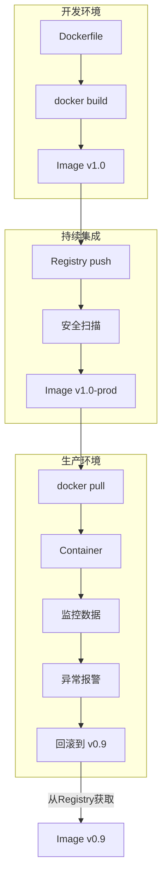

入职新工作接触到了Docker 很高兴终于能干中学Docker了 所以这里就简单记录一下Docker的基础概念

OK Let's Dive in!🤿

## 核心概念

以下是使用Docker的企业级应用发布流程



A：开发Dockerfile 定义应用环境

B：构建可重复的镜像（Image）

D：推送至仓库（Registry）进行版本管理

H：拉取镜像并实例化为容器（Container）

I：基于容器状态监控与调控

### DockerFile

Dockerfile 是指令集合，描述了如何从头开始构建一个可运行的 Docker 镜像层堆栈。

#### 镜像分层与联合文件系统

- 层式结构：镜像由只读层（Read-Only Layers） 堆叠构成，每层记录文件系统的增量变更（文件增删改）。Dockerfile 中每条产生文件变更的指令（如
  RUN, COPY, ADD）均生成新层。
- 联合挂载：运行时通过联合文件系统（如 Overlay2）将多层合并为单一视图，容器进程感知完整的文件系统。
- 写时复制(CoW)：容器启动时创建可写容器层（Container Layer） ，所有写入操作均在此层隔离处理，原始镜像层保持不可变。

#### 构建上下文(Build Context)

在使用 docker build 命令创建镜像时，会产生一个 Build Context。即 docker build
命令的 PATH 或 URL 指定路径中的文件的集合，并且指定路径下的所有文件（含子目录）会被压缩为 tar 包发送至 Docker 引擎。
这意味着 .dockerignore 文件至关重要，它用于排除不需要发送给守护进程的文件（如本地开发配置文件、日志、.git目录、node_modules等），减少上下文大小，加快构建速度，避免敏感信息泄露。
在镜像 build 过程中可以引用上下文中的任何文件，比如COPY 和 ADD 命令，就可以引用上下文中的文件。

#### 关键指令

- FROM：指定基础镜像。你的构建将基于这个镜像进行。
    - 语法：FROM [--platform=\<platform>] \<image>[:\<tag>] [AS \<name>]
    - 最佳实践：
        - 总是指定明确的镜像标签（:后部分），避免使用默认的latest标签（它可能会意外更新），以确保构建的可重复性。例如：FROM
          python:3.11-slim-bullseye。
        - 优先选择官方、稳定、安全、体积小的基础镜像（如 *-alpine, *-slim 变体）。
        - 多阶段构建时，使用 AS 给阶段命名（后面 COPY --from= 会用到）。
    - 示例：FROM ubuntu:22.04 或 FROM node:18-bullseye-slim AS build-stage
- WORKDIR：为后续的 RUN, CMD, ENTRYPOINT, COPY, ADD 指令设置工作目录。如果目录不存在会自动创建。
    - 语法：WORKDIR /path/to/workdir
    - 最佳实践：
        - 总是使用绝对路径。
        - 在构建过程中需要切换目录时使用，避免在命令行里写大量 cd ... && ...。
        - 通常设置在应用程序代码存放的目录。
    - 示例：WORKDIR /app
- COPY&ADD：将本地文件或目录从构建上下文复制到镜像内。
    - 语法：COPY [--chown=\<user>:\<group>] \<src>... \<dest> 或 COPY [--chown=\<user>:\<group>] ["\<src>", ... "\<dest>"] （支持通配符 *）
    - 区别：
        - COPY：推荐优先使用！功能纯粹：复制本地文件 / 目录。语法更清晰。
        - ADD：功能更多但更复杂：
            - 可以自动解压缩本地 src 中的 tar 归档文件。
            - 可以从 URL 下载并复制文件到镜像（但强烈不建议从 URL 直接下载，因为这会破坏构建缓存、需要网络且可能不稳定，应使用RUN
              curl/wget下载并清理）。
    - 最佳实践：
        - 几乎总是使用 COPY。
        - 只在需要自动解压 tar 文件到镜像时才用 ADD。
        - 避免使用 ADD 从 URL 下载文件。
        - 使用 --chown 设置复制文件的所有权（如果非默认用户）。
- RUN：在构建镜像过程中执行命令。通常是安装软件包、编译代码、运行脚本等。
    - 语法：RUN (shell 形式) 或 RUN ["executable", "param1", "param2"] (exec 形式)
    - 最佳实践：
        - 尽量将相关操作合并成一个RUN指令（使用 && 连接命令，\ 换行），避免创建过多不必要的中间层。
        - 清理安装缓存 (apt-get clean, rm -rf /var/lib/apt/lists/*, yum clean all, npm cache clean --force 等) 在同一个
          RUN 指令中完成。
        - 明确指定安装包的版本 (apt-get install -y package=version)，避免意外更新。
        - 处理 apt-get update 失败情况：RUN apt-get update && apt-get install -y ...（在同一指令中）。
    - 示例：
        ```dockerfile
        RUN apt-get update \
            && apt-get install -y --no-install-recommends \
                ca-certificates \
                curl \
                git \
            && rm -rf /var/lib/apt/lists/* \
            && apt-get clean
        ```
- EXPOSE：声明容器运行时监听的端口（仅为元数据，不实际开放端口，需通过 docker run -p 映射宿主端口）。
    - 语法：EXPOSE \<port> [\<port>/\<protocol>...]
    - 最佳实践：声明应用程序实际监听的端口，作为文档并方便使用者知道需要映射哪个端口。
    - 示例：EXPOSE 80/tcp 443/udp
- ENTRYPOINT&CMD：定义容器启动时运行的默认命令。它们协同工作，但优先级和用途略有不同。

  | 指令             | 作用                                                     | 是否可被覆盖                                  | 推荐用法                                                                                          |
  |----------------|--------------------------------------------------------|-----------------------------------------|-----------------------------------------------------------------------------------------------|
  | **ENTRYPOINT** | 指定容器启动时运行的主命令或可执行文件。它就像是命令的固定前缀部分。定义镜像的核心功能。	          | 在docker run时可通过--entrypoint覆盖，但这较少见且不推荐 | ENTRYPOINT ["executable", "param1", "param2"] (exec 形式)                                       |
  | **CMD**        | 指定主命令 (ENTRYPOINT) 的默认参数。为主命令 (ENTRYPOINT) 提供可变的默认参数。	 | docker run 后跟的任何内容会完全替代 CMD             | CMD ["param1", "param2"] (作为 ENTRYPOINT 的参数)CMD ["executable", "param1", "param2"] (单独使用时不推荐) |

    - 常见组合模式：
        - ENTRYPOINT + CMD (推荐)： 这是最常见的模式。
        ```dockerfile
        ENTRYPOINT ["/usr/local/bin/myapp"] # 定义主程序
        CMD ["--help"]                      # 定义启动该主程序时默认传递的参数
        ```
        ```cmd
        docker run my-image：相当于执行 /usr/local/bin/myapp --help
        docker run my-image run --debug：相当于执行 /usr/local/bin/myapp run --debug （run --debug 完全替换了默认的 --help）
        ```
        - 只有 ENTRYPOINT： 强制容器以特定方式运行，不接受额外命令作为参数（除非使用 --entrypoint）。
        - 只有 CMD： 可以直接通过 docker run my-image /bin/bash 等方式完全覆盖启动命令。
    - 最佳实践：
        - 优先使用 exec 形式 (JSON 数组)：如 ENTRYPOINT ["executable", "param1"], CMD ["param1", "param2"]。避免 shell
          形式 (ENTRYPOINT executable param1) 导致子进程无法正常接收信号的问题。
        - 理解二者关系：CMD 提供 ENTRYPOINT 的默认参数。
- VOLUME：创建一个具有指定路径的匿名卷挂载点。当容器启动时，Docker 会自动创建一个匿名卷并挂载到该路径。即使以后容器被删除，该匿名卷也会留存。
    - 语法：VOLUME ["/data"] 或 VOLUME /data /more/data （多个路径）
    - 最佳实践：
        - 用于标记需要持久化数据的目录（如数据库文件、日志文件）。
        - 主要作为镜像提供者的建议，告诉用户该目录的数据应该被持久化。通常在实际运行容器时，使用 -v 或 --mount
          指定具名卷或主机目录挂载更为常用和可控。
    - 示例：VOLUME /var/lib/mysql
- ENV：设置容器构建期与运行时的环境变量，以键值对形式持久化嵌入镜像。
    - 语法：ENV \<key>=\<value> ...（支持一次设置多个）
    - 示例：ENV NODE_ENV=production APP_VERSION=1.0.0
- ARG：声明仅构建阶段有效的临时变量，用于动态注入参数，不保留至运行时。
    - 语法：ARG \<varname>[=\<default value>]
    - 示例：
        ```dockerfile
        ARG APP_VERSION=latest
        ENV APP_VERSION=$APP_VERSION # 如果需要运行时使用，可将其转存到 ENV
        ```
- USER(用户切换)：指定后续指令以哪个用户（和可选的用户组）身份运行（RUN, CMD, ENTRYRYPOINT）。默认是 root。
    - 语法：USER \<user>[:\<group>] 或 USER \<UID>[:\<GID>]
    - 最佳实践：
        - 强烈建议创建非 root 用户并在后面切换到它运行应用程序，增强容器安全性（最小权限原则）。
        - 通常先在某个 RUN 指令中创建好用户和组（并设置合适的权限和目录所有权），再使用 USER。
    - 示例：
        ```dockerfile
        RUN groupadd -r myuser && useradd -r -g myuser myuser
        WORKDIR /app
        COPY --chown=myuser:myuser . .
        USER myuser
        CMD ["python", "app.py"]
        ```
- LABEL(元数据标签)：为镜像嵌入描述性键值对元数据，用于记录作者、许可证等辅助信息。
    - 标注维护者信息（替代已弃用的 MAINTAINER）
    - 标记镜像版本、构建日期、依赖组件清单
    - CI/CD 系统中追踪构建来源

#### 核心原则

- 最小化层数：合并关联的 RUN 指令减少层数（如清理操作合并至同一层）。
- 精简构建上下文：利用 .dockerignore 过滤非必要文件。
- 确定性构建：避免在构建中引入外部动态变量（版本需固定）。
- 无状态化设计：持久化数据应通过 VOLUME 或外部存储卷管理。
- 非特权运行：通过 USER 指令避免以 root 身份运行容器进程。

#### 一个完整的 Node.js 示例

```dockerfile
# Stage 1: Build the application
FROM node:18-bullseye-slim AS builder

# Create app directory (WORKDIR also creates it)
WORKDIR /usr/src/app

# Install app build dependencies (package.json and lockfile first for better caching)
COPY package*.json ./
# Use npm ci for reproducible installs in CI environments, equivalent to npm install with lockfile
RUN npm ci --only=production

# Copy application source code
COPY . .

# Build the app (assuming you have a build script)
RUN npm run build

# Stage 2: Create the production image
FROM node:18-bullseye-slim

# Non-root user setup for better security
RUN groupadd -r nodegroup && useradd -r -g nodegroup nodeuser
RUN mkdir -p /home/node/app && chown -R nodeuser:nodegroup /home/node/app

WORKDIR /home/node/app

# Copy only necessary files from the builder stage
COPY --chown=nodeuser:nodegroup --from=builder /usr/src/app/package*.json ./
COPY --chown=nodeuser:nodegroup --from=builder /usr/src/app/node_modules ./node_modules
COPY --chown=nodeuser:nodegroup --from=builder /usr/src/app/build ./build

# Switch to non-root user
USER nodeuser

# Expose the port the app runs on
EXPOSE 3000

# Define the startup command (exec form)
CMD ["node", "build/index.js"] # Adjust path to your main entry file
```

### 镜像(Image)

不可变交付单元。

### 容器(Container)

标准化运行环境。

### 仓库(Registry)

资产存储与分发枢纽。