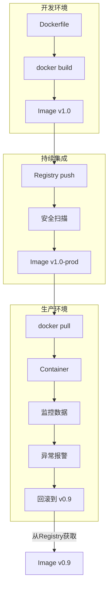

入职新工作接触到了Docker 很高兴终于能干中学Docker了 所以这里就简单记录一下Docker的基础概念

OK Let's Dive in!🤿

## 核心概念

以下是使用Docker的企业级应用发布流程

A：开发Dockerfile 定义应用环境

B：构建可重复的镜像（Image）

D：推送至仓库（Registry）进行版本管理

H：拉取镜像并实例化为容器（Container）

I：基于容器状态监控与调控

### DockerFile

Dockerfile 是指令集合，描述了如何从头开始构建一个可运行的 Docker 镜像层堆栈。

#### 镜像分层与联合文件系统

- 层式结构：镜像由只读层（Read-Only Layers） 堆叠构成，每层记录文件系统的增量变更（文件增删改）。Dockerfile 中每条产生文件变更的指令（如
  RUN, COPY, ADD）均生成新层。
- 联合挂载：运行时通过联合文件系统（如 Overlay2）将多层合并为单一视图，容器进程感知完整的文件系统。
- 写时复制(CoW)：容器启动时创建可写容器层（Container Layer） ，所有写入操作均在此层隔离处理，原始镜像层保持不可变。

#### 构建上下文(Build Context)

在使用 docker build 命令创建镜像时，会产生一个 Build Context。即 docker build
命令的 PATH 或 URL 指定路径中的文件的集合，并且指定路径下的所有文件（含子目录）会被压缩为 tar 包发送至 Docker 引擎。
在镜像 build 过程中可以引用上下文中的任何文件，比如COPY 和 ADD 命令，就可以引用上下文中的文件。

#### 关键指令

- FROM：定义基础镜像层，所有后续操作基于此展开。
- WORKDIR：设定后续指令的工作目录路径，若目录不存在则自动创建。
- COPY&ADD：两者都能从宿主机复制文件至镜像内
    - COPY <src> <dest> ：将文件或者目录中的内容而不包含目录自身复制到镜像中。
    - ADD 额外支持：可以解压缩文件并把它们添加到镜像中，当且仅当此种情况使用ADD。
- RUN：在构建阶段执行命令并提交新层。
- EXPOSE：声明容器运行时监听的端口（仅为元数据，不实际开放端口，需通过 docker run -p 映射宿主端口）。
- ENTRYPOINT&CMD：
    - ENTRYPOINT：定义容器主进程的可执行文件。(会把 docker run 后面的参数传递给ENTRYPOINT指定的参数)
    - CMD：提供主进程的默认参数列表（可被 docker run 后面的参数覆盖）。
- VOLUME：声明持久化目录，使容器内路径与宿主机存储卷关联。构建过程中向声明路径写入的数据不会保留到最终镜像层。
- ENV(环境变量)：设置容器构建期与运行时的环境变量，以键值对形式持久化嵌入镜像。
    - 配置应用运行时参数（如数据库连接字符串）
    - 定义容器内工具的全局路径
- ARG(构建参数)：声明仅构建阶段有效的临时变量，用于动态注入参数，不保留至运行时。
    - 控制软件版本号（如 ARG NODE_VERSION=18）
    - 指定构建模式（Debug/Release）
    - 注：可在 FROM 前声明以用于基础镜像选择
- USER(用户切换)：切换后续指令的执行身份（默认 root），并设定容器启动时的默认用户。
    - 禁止容器以 root 权限运行，遵循最小权限原则
    - 多用户环境下的权限隔离
- LABEL(元数据标签)：为镜像嵌入描述性键值对元数据，用于记录作者、许可证等辅助信息。
    - 标注维护者信息（替代已弃用的 MAINTAINER）
    - 标记镜像版本、构建日期、依赖组件清单
    - CI/CD 系统中追踪构建来源

#### 核心原则

- 最小化层数：合并关联的 RUN 指令减少层数（如清理操作合并至同一层）。
- 精简构建上下文：利用 .dockerignore 过滤非必要文件。
- 确定性构建：避免在构建中引入外部动态变量（版本需固定）。
- 无状态化设计：持久化数据应通过 VOLUME 或外部存储卷管理。
- 非特权运行：通过 USER 指令避免以 root 身份运行容器进程。

### 镜像(Image)

不可变交付单元。

### 容器(Container)

标准化运行环境。

### 仓库(Registry)

资产存储与分发枢纽。