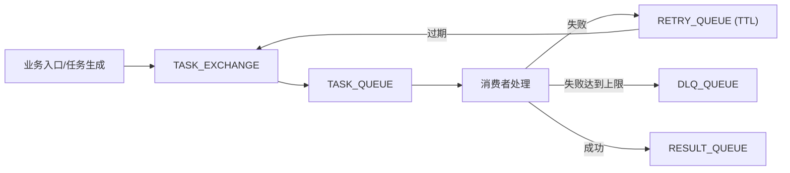

# Spring Boot 项目中的 RabbitMQ 实战：解耦、削峰与可靠性设计

## 引言：为什么引入 MQ（解耦 + 削峰）

引入 RabbitMQ 的核心目标非常明确：**解耦**与**削峰**。

- **解耦**：生产者只关心“投递任务”，消费者只关心“处理任务”，双方独立演进。
- **削峰**：突发流量进入队列缓冲，后台按稳定速率消费，避免直接冲击下游。

## 架构概览：消息流与组件关系

本文示例采用“**任务投递 → 任务处理 → 结果回传**”的链路模式，核心由交换机、主队列、重试队列与死信队列组成。



## 专业术语速查

- **Broker**：邮局/快递中转站。MQ 服务端实例，负责接收、存储、转发消息。
- **Exchange**：分拣台。交换机根据路由规则把消息投递到队列（direct / fanout / topic / headers）。
- **Queue**：排队通道/仓库。消息最终落地的缓冲区，消费者从队列取消息处理。
- **Binding**：把分拣台和通道“连线”。交换机与队列的绑定关系，定义路由键匹配规则。
- **Routing Key**：包裹标签。生产者发送时携带的路由键，用于匹配绑定规则。
- **Message**：包裹 = 内容 + 面单。消息体包含 payload 与 metadata（headers、messageId 等）。
- **Producer / Consumer**：寄件人 / 收件人。生产者发送消息，消费者拉取并处理消息。
- **Connection / Channel**：高速公路 / 车道。Connection 是 TCP 连接；Channel 是其上的轻量复用通道。
- **Virtual Host (vhost)**：同一仓库里的独立小隔间。逻辑隔离空间，区分不同业务/环境。
- **ACK / NACK / Reject**：签收/拒收。ACK 确认成功；NACK/Reject 失败并决定是否重回队列。
- **Prefetch (QoS)**：一次最多拿几件包裹。限制消费者未确认消息的最大数量。
- **TTL**：保质期。消息/队列存活时间，到期后过期或转死信。
- **DLX / DLQ**：问题件回收站。死信交换机与死信队列，承接失败或过期消息。
- **Durable / Persistent**：断电也不丢记录。队列/消息持久化，Broker 重启后仍可恢复。
- **Publisher Confirm / Return**：快递发件回执/退件。发布确认与退回机制，保障投递可靠性。
- **Idempotency（幂等）**：重复点击也只处理一次。同一消息重复消费不产生副作用。

### 举个🌰

| 术语          | 业务例子                             |
|-------------|----------------------------------|
| Broker      | RabbitMQ 服务本体（运维部署的一套 MQ 实例）     |
| Exchange    | `TASK_EXCHANGE`，负责把“任务消息”分发到不同队列 |
| Queue       | `TASK_QUEUE`，存放待处理的任务            |
| Routing Key | `task.process`，用于把任务消息路由到任务队列    |
| Producer    | 业务接口在下单后发送“生成任务”的消息              |
| Consumer    | 后台任务处理服务消费消息并执行处理逻辑              |
| ACK         | 任务处理完成后确认，消息从队列删除                |
| NACK/Reject | 处理失败时拒收，让消息走重试或死信                |
| TTL         | 失败消息先进入重试队列，15 秒后回流主队列           |
| DLQ         | 重试超过上限的消息进入死信队列等待人工处理            |
| Prefetch    | 消费者一次只拉 1 条，避免“抓太多处理不过来”         |
| Idempotency | 任务消息重复投递时，业务只生成一次结果              |

## 全局基础配置：JSON 序列化与统一监听器

使用 Jackson 作为全局消息转换器，避免 Java 原生反序列化带来的安全风险，同时统一序列化策略。

```java

@Configuration
public class MqGlobalConfig {

    @Bean
    public MessageConverter messageConverter(ObjectMapper objectMapper) {
        return new Jackson2JsonMessageConverter(objectMapper);
    }

    @Bean
    public RabbitTemplate rabbitTemplate(ConnectionFactory cf,
                                         MessageConverter converter) {
        RabbitTemplate template = new RabbitTemplate(cf);
        template.setMessageConverter(converter);
        return template;
    }

    @Bean
    public SimpleRabbitListenerContainerFactory listenerContainerFactory(
            ConnectionFactory cf, MessageConverter converter) {
        SimpleRabbitListenerContainerFactory factory = new SimpleRabbitListenerContainerFactory();
        factory.setConnectionFactory(cf);
        factory.setMessageConverter(converter);
        return factory;
    }
}
```

## 场景一：异步任务投递链路（生产者）

生产者只负责将任务投递到交换机，由路由键决定进入哪个队列。

```java

@Component
public class TaskProducer {

    private final RabbitTemplate rabbitTemplate;

    @Value("${app.mq.task.exchange:TASK_EXCHANGE}")
    private String exchange;

    @Value("${app.mq.task.routing-key:task.process}")
    private String routingKey;

    public void send(TaskPayload payload) {
        rabbitTemplate.convertAndSend(exchange, routingKey, payload);
    }
}
```

## 场景二：结果回传处理链路（消费者）

消费者使用 **手动 ACK**，并在异常时进行重试或死信处理。

```java

@Component
public class TaskListener {

    @RabbitListener(
            bindings = @QueueBinding(
                    value = @Queue(value = "${app.mq.task.queue:TASK_QUEUE}", durable = "true"),
                    exchange = @Exchange(value = "${app.mq.task.exchange:TASK_EXCHANGE}"),
                    key = "${app.mq.task.routing-key:task.process}"
            ),
            ackMode = "MANUAL"
    )
    public void onMessage(TaskPayload payload, Message msg, Channel channel) throws IOException {
        long deliveryTag = msg.getMessageProperties().getDeliveryTag();
        try {
            // 核心处理逻辑（脱敏）
            handle(payload);
            channel.basicAck(deliveryTag, false);
        } catch (Exception e) {
            // 失败时走重试/死信
            handleRetryOrDlq(payload, msg, channel, deliveryTag);
        }
    }
}
```

## 可靠性设计：手动 ACK + 限次重试

本文示例采用 **header 计数**方式记录重试次数，避免无限重试带来的雪崩。

```java
public class MqRetryUtil {

    private static final String X_RETRY_COUNT = "x-retry-count";

    public static boolean isRetryExceeded(Message msg, int maxRetry) {
        Integer retry = (Integer) msg.getMessageProperties().getHeaders().get(X_RETRY_COUNT);
        return (retry == null ? 0 : retry) >= maxRetry;
    }

    public static void republishWithRetry(Channel channel,
                                          long deliveryTag,
                                          byte[] body,
                                          String routingKey,
                                          MessageProperties props) throws IOException {
        channel.basicNack(deliveryTag, false, false);

        Map<String, Object> headers = new HashMap<>(
                props.getHeaders() == null ? Map.of() : props.getHeaders()
        );
        int nextRetry = headers.getOrDefault(X_RETRY_COUNT, 0) + 1;
        headers.put(X_RETRY_COUNT, nextRetry);

        AMQP.BasicProperties newProps = new AMQP.BasicProperties.Builder()
                .headers(headers)
                .build();

        channel.basicPublish("", routingKey, newProps, body);
    }
}
```

## 延迟与失败处理：TTL + DLX 模式

本文示例采用“**TTL 延迟重试队列 + DLX 回流**”模式实现简单可靠的重试逻辑。

```java

@Bean
public Queue retryQueue() {
    return QueueBuilder.durable("TASK_RETRY_QUEUE")
            .withArgument("x-message-ttl", 15000) // 15 秒后转回主队列
            .withArgument("x-dead-letter-exchange", "TASK_EXCHANGE")
            .withArgument("x-dead-letter-routing-key", "task.process")
            .build();
}

@Bean
public Queue dlqQueue() {
    return QueueBuilder.durable("TASK_DLQ_QUEUE").build();
}
```

## 并发与性能调优：prefetch + 并发范围

为避免消费者一次性抓取过多消息，使用 **prefetch = 1**，并支持“最小-最大”并发配置。

```java

@Bean("taskListenerFactory")
public SimpleRabbitListenerContainerFactory taskListenerFactory(
        ConnectionFactory cf,
        MessageConverter converter,
        ThreadPoolTaskExecutor executor,
        @Value("${app.mq.task.prefetch:1}") int prefetch,
        @Value("${app.mq.task.concurrency:1-3}") String concurrency) {

    SimpleRabbitListenerContainerFactory factory = new SimpleRabbitListenerContainerFactory();
    factory.setConnectionFactory(cf);
    factory.setPrefetchCount(prefetch);
    factory.setMessageConverter(converter);
    factory.setAcknowledgeMode(AcknowledgeMode.MANUAL);
    factory.setTaskExecutor(executor);

    int[] range = parseConcurrency(concurrency, 1, 3);
    factory.setConcurrentConsumers(range[0]);
    factory.setMaxConcurrentConsumers(range[1]);
    return factory;
}
```

## 日志与可观测性

关键日志建议至少包含：

- `messageId / deliveryTag`
- `exchange / routingKey`
- `taskId`（业务脱敏 ID）
- `retryCount`

这样能快速定位消息路径与失败原因。

## 配置示例（脱敏版）

```yaml
app:
  mq:
    task:
      exchange: TASK_EXCHANGE
      queue: TASK_QUEUE
      routing-key: task.process
      prefetch: 1
      concurrency: 1-3
      max-retry-count: 3
      listener-enabled: true
```

## 常见问题与踩坑总结

- 重试必须限次，否则会造成消息风暴。
- TTL 重试适合简单延迟，复杂延迟可用延迟交换机或调度服务。
- 一旦使用手动 ACK，务必确保异常路径也能明确 ACK/NACK。
- 消费者并发与 prefetch 必须匹配，否则容易出现“假并发”。
